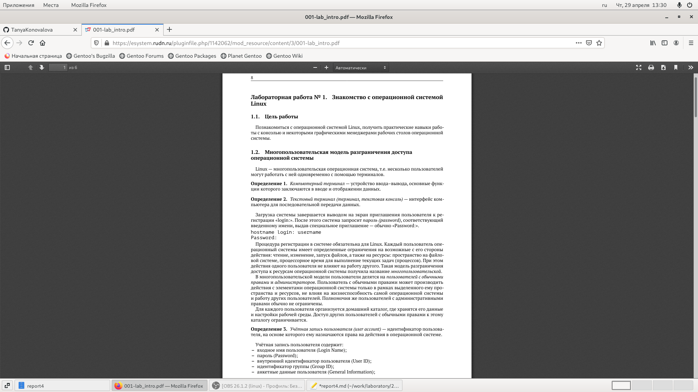
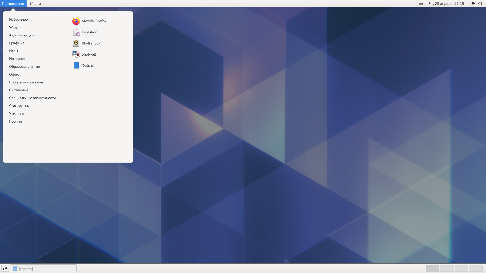
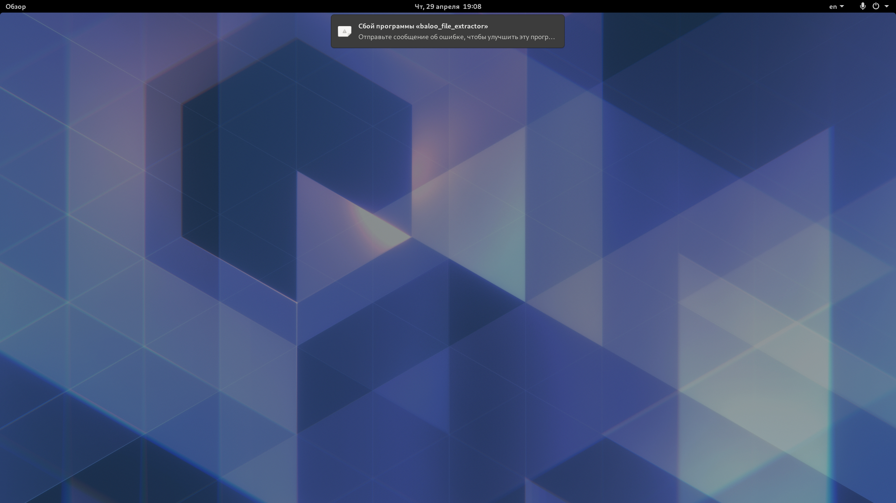
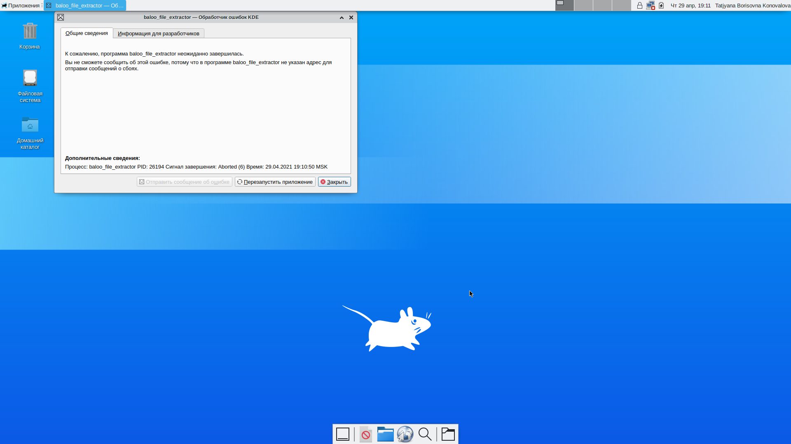
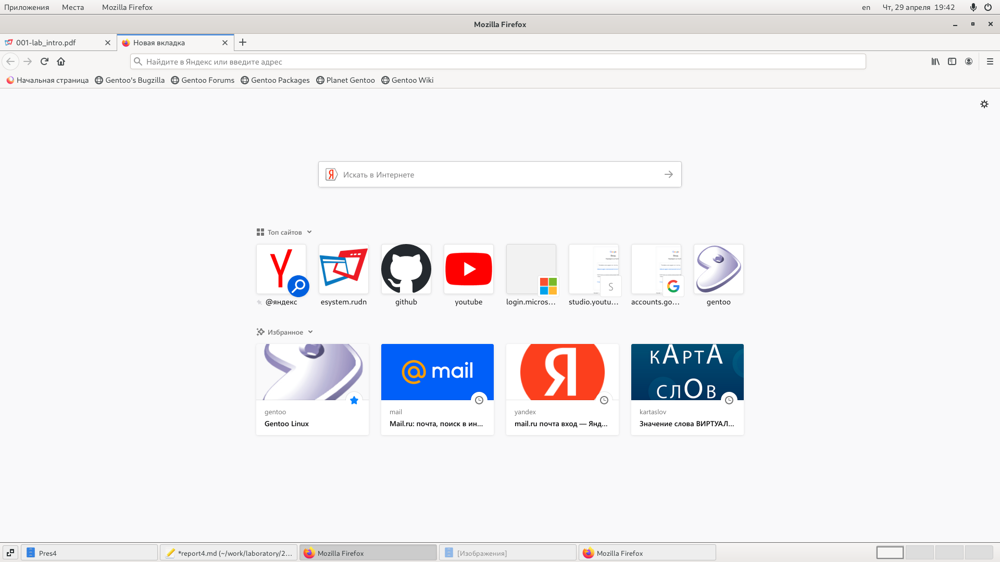
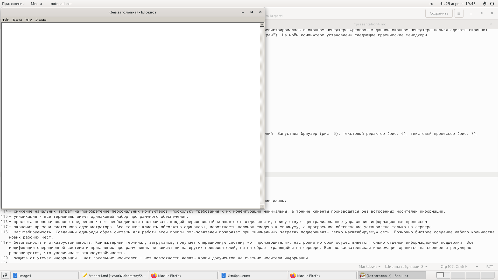
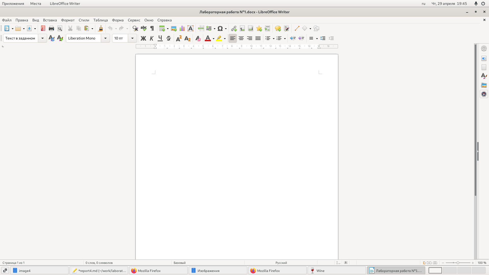
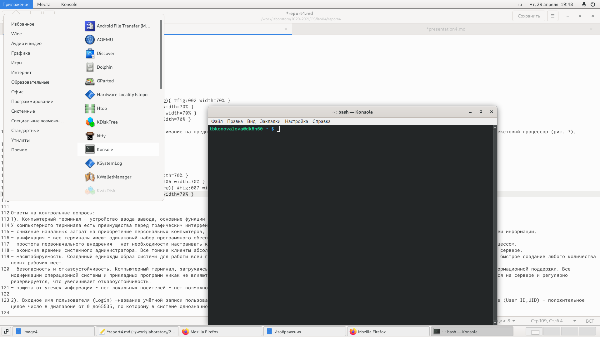

---
## Front matter
lang: ru-RU
title: Отчёт по лабораторной работе №4
author: Коновалова Татьяна Борисовна
institute: РУДН, Москва, Россия

date: 28 Апреля 2021

## Formatting
toc: false
slide_level: 2
theme: metropolis
header-includes: 
 - \metroset{progressbar=frametitle,sectionpage=progressbar,numbering=fraction}
 - '\makeatletter'
 - '\beamer@ignorenonframefalse'
 - '\makeatother'
aspectratio: 43
section-titles: true
---

# Отчет по лабораторной работы №4

## Ознакомление с теоретическим материалом

Теоретический материал, представленный в лабораторной работе №4, потребуется нам для ответа на контрольные вопросы (см в отчёте).

{ #fig:001 width=70% }

## Работа с текстовой консолью

- Переключение между консолями осуществляется при помощи сочетания клавиши “Alt” с одной из функциональных клавиш (F1–F6);
- Для того, чтобы завершить сеанс в текстовой консоли необходимо испоьзовать слеющую комбинацию клавиш: “Ctrl+D”;
- Для перехода из текстового режима в графический интерфейс необходимо нажать комбинацию клавиш “Ctrl+Alt+F7”.

## Менеджер графических столов

- На слеющий скриншотах представлены графические менеджеры, которые я сравнивала в Лабораторной работе №4

{ #fig:002 width=70% }
{ #fig:003 width=70% }
{ #fig:004 width=70% }

## Работа с установленными программами

Название программ:
- для браузера - Mozila Firefox;
- для текстового редактора - "Блокнот";
- для текстового процессора -  LibreOffice Writer;
- эмулятор консоли - Konsole.

{ #fig:005 width=70% }
{ #fig:006 width=70% }
{ #fig:007 width=70% }
{ #fig:008 width=70% }

## Выводы

Познакомилась с операционной системой Linux, получила практические навыки работы с консолью и некоторыми графическими менеджерами рабочих столов операционной системы.

## {.standout}

Спасибо за внимание!
