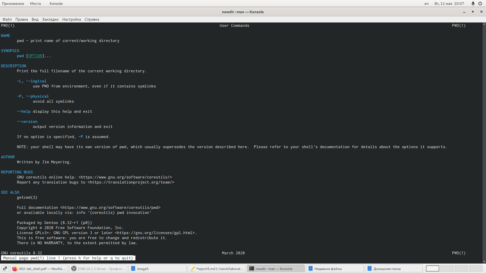
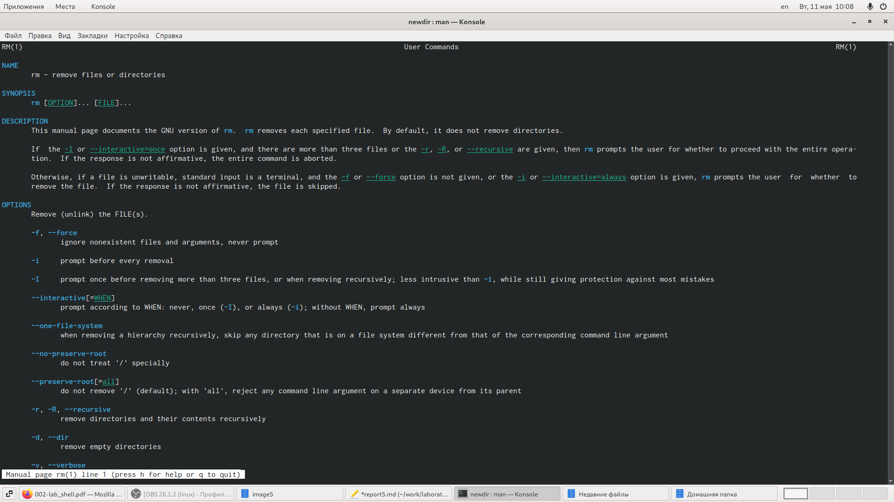

---
## Front matter
lang: ru-RU
title: Отчёт по лабораторной работе №5
author: Коновалова Татьяна Борисовна
institute: РУДН, Москва, Россия

date: 28 Апреля 2021

## Formatting
toc: false
slide_level: 2
theme: metropolis
header-includes: 
 - \metroset{progressbar=frametitle,sectionpage=progressbar,numbering=fraction}
 - '\makeatletter'
 - '\beamer@ignorenonframefalse'
 - '\makeatother'
aspectratio: 43
section-titles: true
---

# Отчет по лабораторной работы №5

## Основные команды в Linux

Используя команду man для следующих команд: cd, pwd, mkdir, rmdir, rm, просматривала описание соответствующих команд

{ #fig:001 width=70% }

## Команды pwd

1. -L, --logical - не разыменовывать символические ссылки. Если путь содержит ссылки, то выводить их без преобразования в исходный путь;
2. -P, --physical - преобразовывать символические ссылки в исходные имена. Если путь содержит данные ссылки, то они будут преобразованы в названия исходных директорий (на которые они указаны).
3. --help - показать справку по команде pwd;
4. --version - показать версию утилиты pwd.
{ #fig:002 width=70% }

## Команды mkdir

1. -m,--mode=MODE - устанавливает  права  доступа  для  создаваемой  директории. Синтаксис MODE такой же как у команды chmod;
2. -p,--parents - создаёт  все  директории,  которые  указаны  внутри  пути (если директория существует, сообщение об этом не выводится);
3. -v, --verbose - выводит сообщение о каждой создаваемой директории;
4. -z - устанавливает контекст  SELinux  для  создаваемой  директории  по умолчанию;
5. --context[=CTX] - устанавливает контекст  SELinux  для  создаваемой  директории  в значение CTX;
6. --help - показывает справку по команде mkdir;
7. --version - показывает версию утилиты mkdir.
{ #fig:003 width=70% }

## Команды rmdir

1. --ignore-fail-on-non-empty - игнорировать директории, которые содержат в себе файлы;
2. -p, --parents - в  этой  опции  каждый  аргумент  каталога  обрабатывается  как путь, из которого будут удалены все компоненты, если они уже пусты, начиная с последнего компонента;
3. -v, --verbose - отображение    подробной    информациидля    каждого обрабатываемого каталога;
4. --help - показать справку по команде rmdir;
5. --version - показать версию утилиты rmdir.
{ #fig:004 width=70% }

## Команды rm

1. -f, --force - игнорировать несуществующие файлы и аргументы. Никогда не выдавать запросы на подтверждение удаления;
2. -i - выводить запрос на подтверждение удаления каждого файла;
3. -I - выдать  один  запрос  на  подтверждение  удаления  всех  файлов, если  удаляется  больше  трех  файлов  или  используется рекурсивное   удаление.   Опция   применяется,   как   более «щадящая» версия опции –i;
4. --interactive[=WHEN] - вместо WHEN можно использовать:never — никогда  не  выдавать  запросы  на  подтверждение удаления, once — выводить запрос один раз (аналог опции -I).
always —выводить запрос всегда (аналог опции -i).Если значение КОГДА не задано, то используется always;
5. --one-file-system - во  время  рекурсивного  удаления  пропускать  директории, которые находятся на других файловых системах;
6. --no-preserve-root - если в качестве директории для удаления задан корневой раздел /, то считать, что это обычная директория и начать выполнять удаление;
7. --preserve-root[=all] - если в качестве директории для удаления задан корневой раздел /, то запретить выполнять команду rm над корневым разделом. Данное поведение используется по умолчанию;
8. -r, -R, --recursive - удаление директорий и их содержимого. Рекурсивное удаление;
9. -d, --dir - удалять пустые директории;
10. -v, --verbose - выводить информацию об удаляемых файлах;
11. --help - показать справку по команде rm;
12. --version - показать версию утилиты rm
{ #fig:005 width=70% }

## Выводы

Приобрела практические навыки взаимодействия пользователя с системой посредством командной строки.

## {.standout}

Спасибо за внимание!
