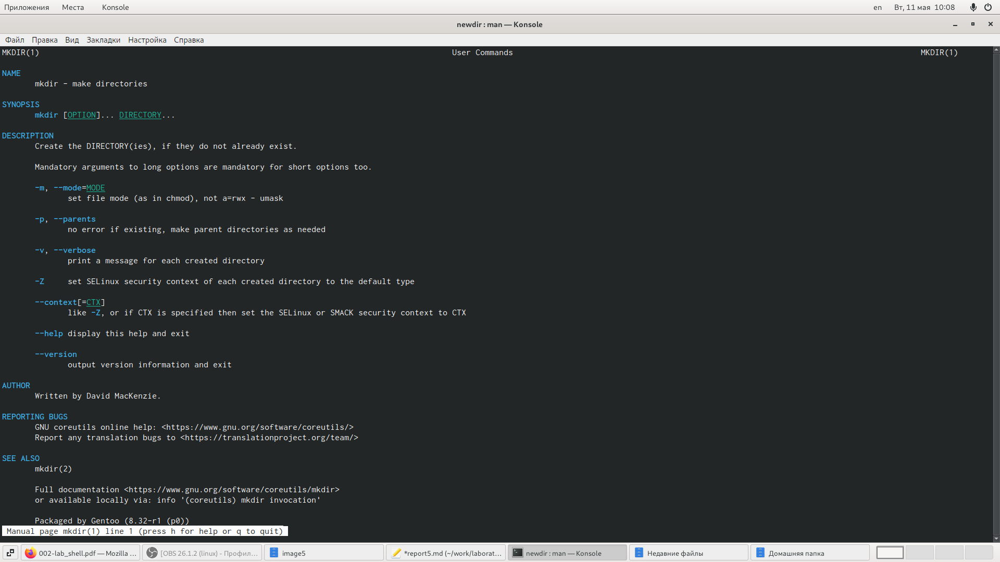

---
# Front matter
lang: ru-RU
title: "Лабораторная работа №5"
subtitle: "Дисциплина: Операционные системы"
author: "Коновалова Татьяна Борисовна"

# Formatting
toc-title: "Содержание"
toc: true # Table of contents
toc_depth: 2
lof: true # List of figures
lot: true # List of tables
fontsize: 12pt
linestretch: 1.5
papersize: a4paper
documentclass: scrreprt
polyglossia-lang: russian
polyglossia-otherlangs: english
mainfont: PT Serif
romanfont: PT Serif
sansfont: PT Sans
monofont: PT Mono
mainfontoptions: Ligatures=TeX
romanfontoptions: Ligatures=TeX
sansfontoptions: Ligatures=TeX,Scale=MatchLowercase
monofontoptions: Scale=MatchLowercase
indent: true
pdf-engine: lualatex
header-includes:
  - \linepenalty=10 # the penalty added to the badness of each line within a paragraph (no associated penalty node) Increasing the value makes tex try to have fewer lines in the paragraph.
  - \interlinepenalty=0 # value of the penalty (node) added after each line of a paragraph.
  - \hyphenpenalty=50 # the penalty for line breaking at an automatically inserted hyphen
  - \exhyphenpenalty=50 # the penalty for line breaking at an explicit hyphen
  - \binoppenalty=700 # the penalty for breaking a line at a binary operator
  - \relpenalty=500 # the penalty for breaking a line at a relation
  - \clubpenalty=150 # extra penalty for breaking after first line of a paragraph
  - \widowpenalty=150 # extra penalty for breaking before last line of a paragraph
  - \displaywidowpenalty=50 # extra penalty for breaking before last line before a display math
  - \brokenpenalty=100 # extra penalty for page breaking after a hyphenated line
  - \predisplaypenalty=10000 # penalty for breaking before a display
  - \postdisplaypenalty=0 # penalty for breaking after a display
  - \floatingpenalty = 20000 # penalty for splitting an insertion (can only be split footnote in standard LaTeX)
  - \raggedbottom # or \flushbottom
  - \usepackage{float} # keep figures where there are in the text
  - \floatplacement{figure}{H} # keep figures where there are in the text
---

# Цель работы

Цель данной лабораторной работы --- Приобретение практических навыков взаимодействия пользователя с системой посредством командной строки.

# Задание

1.Сделать отчёт по лабораторной работе №5 в формате Markdown.
2.Приобрести практические навыки взаимодействия пользователя с системой.

# Выполнение лабораторной работы

1). Определила полное имя домашнего каталога, используем команду pwd, так как уже находимся в домашнем каталоге (обозн. ~) (иллюстрация на рис. 1). 
Имя моего домашнего каталога: /afs/.dk.sci.pfu.edu.ru/home/t/b/tbkonovalova

{ #fig:001 width=70% }

2). 
	2.1). Перешла в каталог/tmp (команда cd /tmp) (Рисунок 2).
	{ #fig:002 width=70% }
	
	2.2).Выводим на экран содержимое каталога /tmp. Для этого используем команду ls с различными опциями (Рисунок 2, 3):
		1. "ls" - используется для просмотра содержимого каталога. Для этого вручную открываем каталог tmp;
		2. "ls -a" - используется для того, чтобы отобразить имена скрытых файлов;
		3. "ls -F" - команда для того, чтобы получить информацию о типах файлов (каталог, исполняемый файл, ссылка). При использовании этой опции вполе имени выводится символ, который определяет тип файла;
		4. "ls -l" - команда для того, чтобы вывести на экран подробную информацию о файлах и каталогах;
		5. "ls -alF" - данная команда отобразит список всех каталогов и файлов, в том числе и скрытых, с подробной информацией о них. 
	{ #fig:003 width=70% }
	
	2.3). Для того, чтобы определить, есть ли в каталоге /var/spool подкаталог с именем cron, необходимо перейти в указанный каталог, использу команду "cd /var/spool". Теперь необходимо просмотреть его содержимое с помощью команды ls. (иллюстрация на рис. 4). Таким образом, мы убедилимь, что данный подкаталог существует.
	{ #fig:004 width=70% }
	
	2.4). Перешла в домашний каталог и проверила его содержимое (алгоритм действий представлен на рис. 5). Владельцем файлов и подкаталогов является tbkonovalova (иллюстрация на рис. 6).
	{ #fig:005 width=70% }
	{ #fig:006 width=70% }
	
3). 
	3.1). В домашнем каталоге создала новый каталог с именем newdir (скриншот 7).
	3.2). В каталоге ~/newdir создала новый каталог с именем morefun. С помощью команды "ls" проверяем правильность выполненных действий.
	{ #fig:007 width=70% }
	
	3.3). В домашнем каталоге создала с помощью одной командой (mkdir) три новых каталога с именами "letters, memos, misk". Затем удалила эти каталоги одной командой "rm -r letters, memos, misk". Проверяем правильность выполненных действий с помощью команды ls (алгоритм действий представлен на рис. 8).
	{ #fig:008 width=70% }
	
	3.4). Пробуем удалить ранее созданный каталог ~/newdir командой rm. Каталог не был удалён (получаем отказ в выполнении команды, так как данный каталог содержит подкаталог и требует при удалении использовать опцию -r) (см. рисунок 9).
	{ #fig:009 width=70% }
	
	3.5). Удаляем каталог ~/newdir/morefun из домашнего каталога. Для этого используем команду "rm -r newdir/morefun". Командой ls проверяем правильность выполненных действий (см. рисунок 9).

4). Используя команду "man ls", опредяем, какую опцию команды ls необходимо использовать, чтобы просмотреть содержимое не только указанного каталога, но и подкаталогов, входящих в него (иллюстрация на рис. 10, 11).
{ #fig:010 width=70% }
{ #fig:011 width=70% }

5). Используя то же руководство по команде "ls", открытое в предыдущем пункте, определяем набор опции команды ls. Данный набор опций позволяет отсортировать по времени последнего изменения выводимый список содержимого каталога с развернутым описанием файлов (иллюстрации на рис. 12, 13, 14).
{ #fig:011 width=70% }

6). Используя команду man для следующих команд: cd, pwd, mkdir, rmdir, rm, просматриваю описание соответствующих команд (алгоритм действий представлен на рис. 16). Команда cd не имеет дополнительных опций.
{ #fig:012 width=70% }
	
-Команда pwd (Рисунок 13);
1. -L, --logical - не разыменовывать символические ссылки. Если путь содержит ссылки, то выводить их без преобразования в исходный путь;
2. -P, --physical - преобразовывать символические ссылки в исходные имена. Если путь содержит данные ссылки, то они будут преобразованы в названия исходных директорий (на которые они указаны).
3. --help - показать справку по команде pwd;
4. --version - показать версию утилиты pwd.
{ #fig:013 width=70% }

-Коамнда mkdir (Рисунок 14);
1. -m,--mode=MODE - устанавливает  права  доступа  для  создаваемой  директории. Синтаксис MODE такой же как у команды chmod;
2. -p,--parents - создаёт  все  директории,  которые  указаны  внутри  пути (если директория существует, сообщение об этом не выводится);
3. -v, --verbose - выводит сообщение о каждой создаваемой директории;
4. -z - устанавливает контекст  SELinux  для  создаваемой  директории  по умолчанию;
5. --context[=CTX] - устанавливает контекст  SELinux  для  создаваемой  директории  в значение CTX;
6. --help - показывает справку по команде mkdir;
7. --version - показывает версию утилиты mkdir.
{ #fig:014 width=70% }

-Команда rmdir (Рисунок 15);
1. --ignore-fail-on-non-empty - игнорировать директории, которые содержат в себе файлы;
2. -p, --parents - в  этой  опции  каждый  аргумент  каталога  обрабатывается  как путь, из которого будут удалены все компоненты, если они уже пусты, начиная с последнего компонента;
3. -v, --verbose - отображение    подробной    информациидля    каждого обрабатываемого каталога;
4. --help - показать справку по команде rmdir;
5. --version - показать версию утилиты rmdir.
{ #fig:015 width=70% }

-Команда rm (Рисунок 16);
1. -f, --force - игнорировать несуществующие файлы и аргументы. Никогда не выдавать запросы на подтверждение удаления;
2. -i - выводить запрос на подтверждение удаления каждого файла;
3. -I - выдать  один  запрос  на  подтверждение  удаления  всех  файлов, если  удаляется  больше  трех  файлов  или  используется рекурсивное   удаление.   Опция   применяется,   как   более «щадящая» версия опции –i;
4. --interactive[=WHEN] - вместо WHEN можно использовать:never — никогда  не  выдавать  запросы  на  подтверждение удаления, once — выводить запрос один раз (аналог опции -I).
always —выводить запрос всегда (аналог опции -i).Если значение КОГДА не задано, то используется always;
5. --one-file-system - во  время  рекурсивного  удаления  пропускать  директории, которые находятся на других файловых системах;
6. --no-preserve-root - если в качестве директории для удаления задан корневой раздел /, то считать, что это обычная директория и начать выполнять удаление;
7. --preserve-root[=all] - если в качестве директории для удаления задан корневой раздел /, то запретить выполнять команду rm над корневым разделом. Данное поведение используется по умолчанию;
8. -r, -R, --recursive - удаление директорий и их содержимого. Рекурсивное удаление;
9. -d, --dir - удалять пустые директории;
10. -v, --verbose - выводить информацию об удаляемых файлах;
11. --help - показать справку по команде rm;
12. --version - показать версию утилиты rm
{ #fig:016 width=70% }

7). Вывела историю команд с помощью команды «history» (Алгоритм действий представлен на рис. 17). Далее,  используя  команды,  "!419" и  "!413", выполним  команды 419 и 413. 
{ #fig:017 width=70% }
{ #fig:018 width=70% }
{ #fig:019 width=70% }
{ #fig:020 width=70% }
{ #fig:021 width=70% }

Ответы на контрольные вопросы:
1). Командная строка – специальная  программа, позволяющая  управлять операционной  системой  при  помощи  текстовых  команд,  вводимых  в окне приложения.
2). Для определения абсолютного пути к текущему каталогу используется команда  pwd  (print  working  directory). Например,  команда  «pwd»  в моем домашнем каталоге выведет: /home/tbkonovalova
3). Команда  «ls-F» (или  «ls-aF»,  тогда  появятся  еще  скрытые  файлы) выведет имена файлов в текущем каталоге и их типы. Тип каталога обозначается /, тип исполняемого файла обозначается *, тип ссылки обозначается @. Пример на Рисунке 2.
4). Имена  скрытых  файлов  начинаются  с  точки.  Эти  файлы  в операционной системе скрыты от просмотра и обычно используются для  настройки  рабочей  среды.  Для  того,  чтобы  отобразить  имена скрытых файлов, необходимо использовать команду «ls –a». Пример на Рисунке 2.
5). Команда  rm  используется  для  удаления  файлов  и/или  каталогов. Команда rm-i выдает  запрос  подтверждения  наудаление  файла. Команда rm-r необходима, чтобы удалить каталог, содержащий файлы. Без указания этой опции команда не будет выполняться. Если каталог пуст,  то  можно  воспользоваться  командой  rmdir.  Если  удаляемый каталог  содержит  файлы,  то  команда  не  будет выполнена –нужно использовать «rm -r имя_каталога».Таким  образом,  каталог,  не  содержащий  файлов,  можно  удалить  и командой rm, и командой rmdir. Файл командой rmdir удалить нельзя. Примеры на Рисунке 9.
6). Чтобы  определить,  какие  команды  выполнил  пользователь  в  сеансе работы, необходимо воспользоваться командой «history».
7). Чтобы  исправить  илизапустить  на  выполнение  команду,  которую пользователь уже использовал в сеансе работы, необходимо: в первом случае:воспользоваться конструкцией !<номер_команды>:s/<что_меняем>/<на_что_меняем>,   во   втором случае: !<номер_команды>. Примеры на Рисунке 21.
8). Чтобы записать в одной строке несколько команд, необходимо между ними поставить ; . Например, «cd /tmp; ls».
9). Символ  обратного  слэша позволяет  использовать  управляющие символы  (".",  "/",  "$",  "*",  "[",  "]",  "^",  "&")  без  их  интерпретации командной оболочкой; процедура  добавления данного  символа  перед управляющими  символами  называетсяэкранированием  символов. Например,  команда  «lsnewdir\/morefun»  отобразит  содержимое каталога newdir/morefun.
10). Команда «ls -l» отображает список каталогов и файлов с подробной информацией  о  них (тип  файла,  право  доступа, число  ссылок, владелец, размер, дата последней ревизии, имя файла или каталога).
11). Полный, абсолютный путь от корня файловой системы –этот путь начинается от корня "/" и описывает весь путь к файлуили каталогу; Относительный  путь – это  путь  к файлу  относительно  текущего каталога(каталога,  где  находится  пользователь). Например, «cd/newdir/morefun» – абсолютный  путь,  «cdnewdir» – относительный путь.
12). Чтобы получить необходимую информацию о команде, необходимо воспользоваться конструкцией man[имя_команды], либо использовать опцию help, которая предусмотрена для некоторых команд.
13). Для автоматического дополнения вводимых команд служит клавиша Tab.

# Выводы

Приобрела практические навыки взаимодействия пользователя с системой посредством командной строки.
