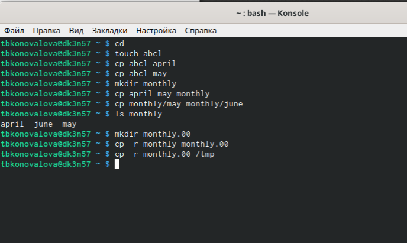
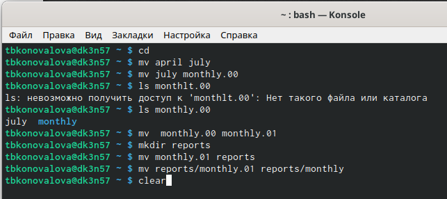
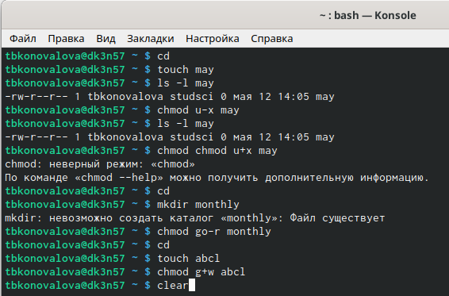
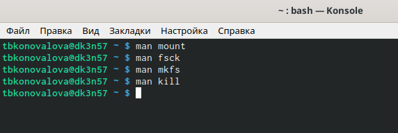

---
## Front matter
lang: ru-RU
title: Отчёт по лабораторной работе №6
author: Коновалова Татьяна Борисовна
institute: РУДН, Москва, Россия

date: 28 Апреля 2021

## Formatting
toc: false
slide_level: 2
theme: metropolis
header-includes: 
 - \metroset{progressbar=frametitle,sectionpage=progressbar,numbering=fraction}
 - '\makeatletter'
 - '\beamer@ignorenonframefalse'
 - '\makeatother'
aspectratio: 43
section-titles: true
---

# Отчет по лабораторной работы №6

## Копирование каталогов и файлов

1.1. Копирование файла в текущем каталоге. Скопировала файл ~/abc1 в файл april и в файл may: создаём файл abcl (команда "touch abcl"), копируем, используя команду "cp abcl april" и "cp abcl may" (алгоритм действий представлен на рис. -@fig:001).
1.2. Копирование нескольких файлов в каталог. Скопировала файлы april и may в каталог monthly.

{ #fig:001 width=70% }

## Перемещение и переименование файлов и каталогов

2.1. Переименование файлов в текущем каталоге. Изменила название файла april на july в домашнем каталоге.
2.2. Перемещение файлов в другой каталог. Переместила файл july в каталог monthly.00 (с помощью команды mv). 

{ #fig:002 width=70% }

## Изменение прав доступа

3.1. Создала файл ~/may с правом выполнения для владельца.
3.2. Лишила владельца файла~/mayправа на выполнение.

{ #fig:003 width=70% }

## Работа с командами man

5.1. Команда mount: предназначена для монтирования файловой системы. Команда mount служит для  подключения  файловых систем разных устройств к  этому большому дереву. Наиболее часто встречающаяся форма команды mount выглядит следующим образом: «mount -t vfstype device dir». 

5.2. Команда fsck: это утилита командной строки, которая позволяет выполнять проверки согласованности  и  интерактивное  исправление  в  одной  или нескольких  файловых  системах  Linux.

{ #fig:011 width=70% }

## Работа с командами man

5.3. Команда mkfs: создаёт новую файловую систему Linux. Имеет следующий синтаксис: mkfs[-V] [-tfstype] [fs-options] filesys [blocks] mkfs используется  для  создания файловой системы Linux на некотором устройстве, обычно в разделе жёсткого диска. В качестве аргумента file sys для  файловой  системы  может  выступать  или название  устройства  (например,/dev/hda1,/dev/sdb2) или точка монтирования (например,/,/usr,/home). 

5.4. Команда kill: посылает сигнал процессу или выводит список допустимых сигналов. Имеет следующий синтаксис: kill [опции] PID, где PID – это  PID  (числовой  идентификатор) процесса или несколько PID процессов, если требуется послать сигнал сразу нескольким процессам. Например, команда «kill -KILL 3121» посылает сигнал KILL процессу с PID 3121, чтобы принудительно завершить процусс.

## Выводы

В ходе выполнения данной лабораторной работы я ознакомилась с  файловой  системой  Linux,  её  структурой,  именами  и  содержанием каталогов,  получила  навыки по  применению  команд  для  работы  с файлами  и  каталогами,  по  управлению  процессами  (и  работами),  по проверке использования диска и обслуживанию файловой системы.

## {.standout}

Спасибо за внимание!
