---
## Front matter
lang: ru-RU
title: Отчёт по лабораторной работе №7
author: Коновалова Татьяна Борисовна
institute: РУДН, Москва, Россия

date: 28 Апреля 2021

## Formatting
toc: false
slide_level: 2
theme: metropolis
header-includes: 
 - \metroset{progressbar=frametitle,sectionpage=progressbar,numbering=fraction}
 - '\makeatletter'
 - '\beamer@ignorenonframefalse'
 - '\makeatother'
aspectratio: 43
section-titles: true
---

# Отчет по лабораторной работы №7

## Запись в файл

Записала, в файл file.txt название файлов, содержащийхся в определённом каталоге. Для того, чтобы записать в файл file.txt названия файлов, содержащихся в каталоге /etc, использовала команду «ls–a/etc> file.txt». Далее с помощью команды «ls-a~ >> file.txt» дописываю в этот же файл названия файлов, содержащихся в домашнем каталоге. Командой «catfile.txt» просматриваю файл, чтобы  убедиться  в  правильности действий (алгоритм действий представлен на рис. -@fig:001 , -@fig:002).

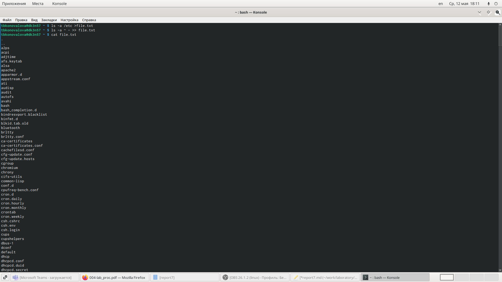{ #fig:001 width=70% }

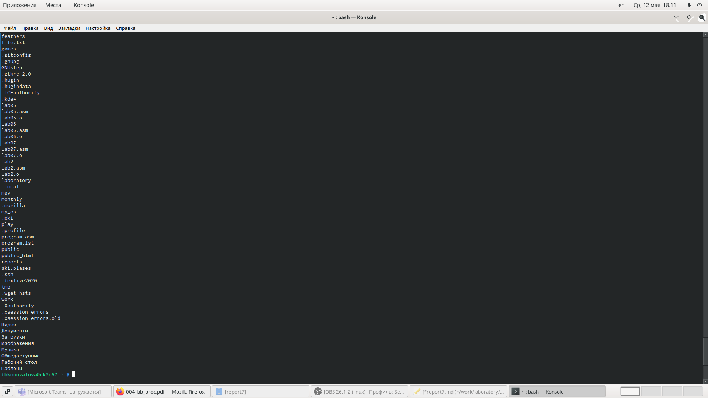{ #fig:002 width=70% }

## Редактор gedit

Запускаю  редактор gedit в  фоновом режиме командой «gedit&» (Рисунок -@fig:012). После этого на экране появляется окно редактора.

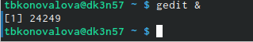{ #fig:012 width=70% }

## Работа с командой gedit

Чтобы определить идентификатор процесса gedit, использую команду «ps| grep-i“gedit”» (Скриншот -@fig:013). Из рисунка видно, что наш процесс имеет PID 24249. Узнать  идентификатор  процесса  можно  также, используя команду «pgrep gedit»или «pidof gedit».

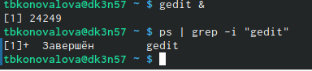{ #fig:013 width=70% }

## Команда kill

Прочитав информацию о команде kill с помощью команды «man kill», использую её для завершения процесса gedit (команда «kill 24249») (Алгоритм действий представлен на рис. -@fig:014 , -@fig:015 , -@fig:016).

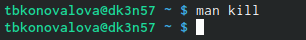{ #fig:014 width=70% }

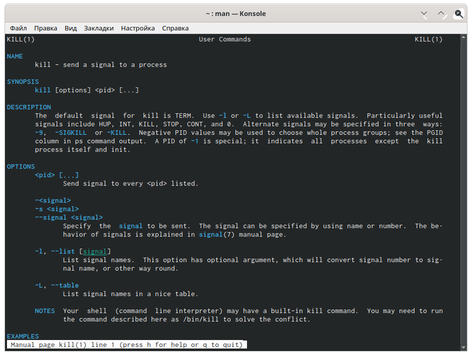{ #fig:015 width=70% }

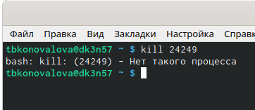{ #fig:016 width=70% }

## Команды df, du

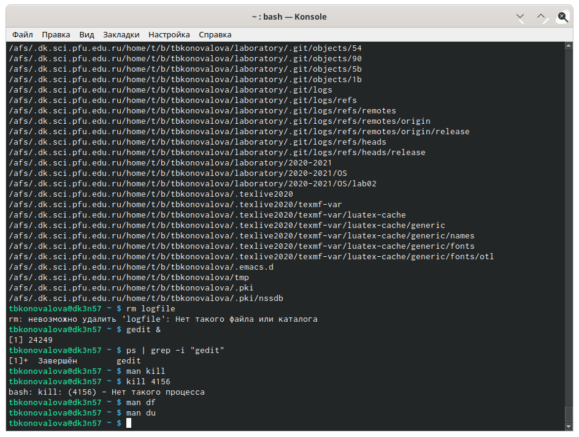{ #fig:017 width=70% }

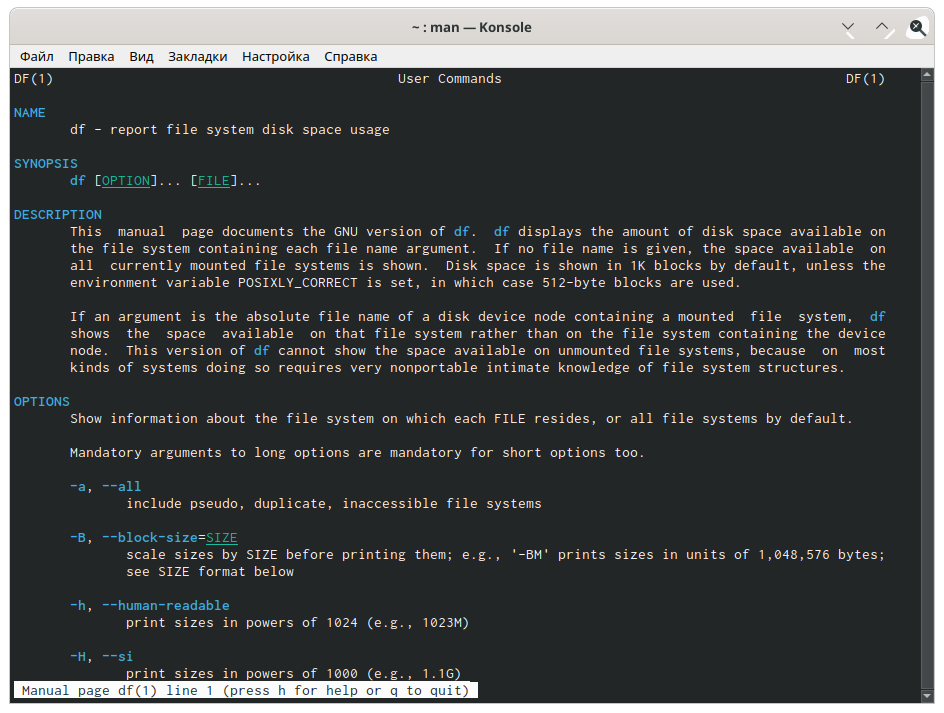{ #fig:018 width=70% }

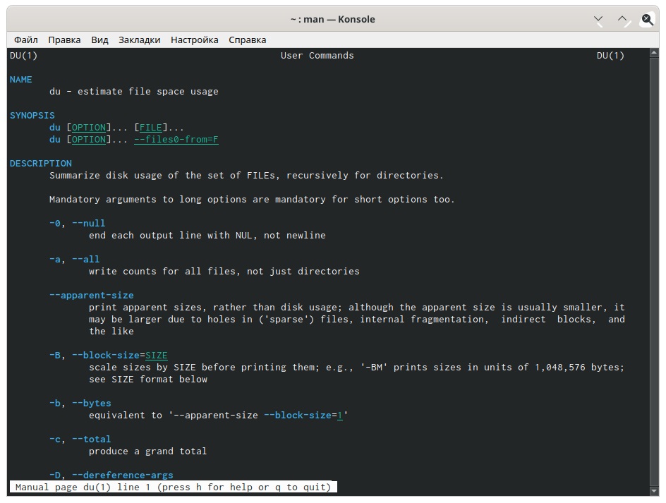{ #fig:019 width=70% }

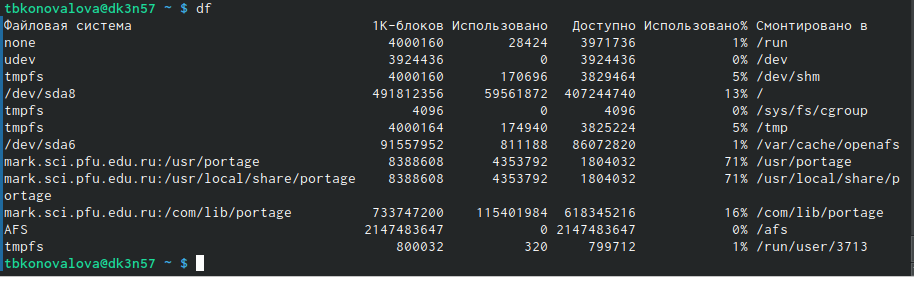{ #fig:020 width=70% }

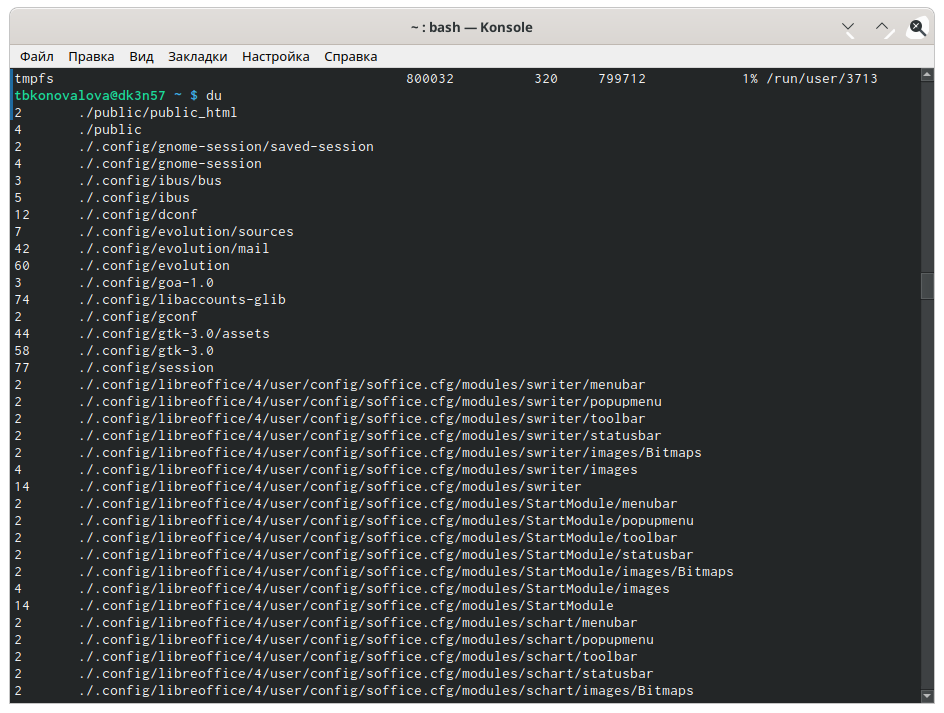{ #fig:021 width=70% }

## Выводы

В ходе выполнения данной лабораторной работы я изучила инструменты поиска файлови фильтрации текстовых данных, а также приобрела  практические  навыки:  по  управлению  процессами  (и заданиями), по проверке использования диска и обслуживанию файловых систем.

## {.standout}

Спасибо за внимание!
