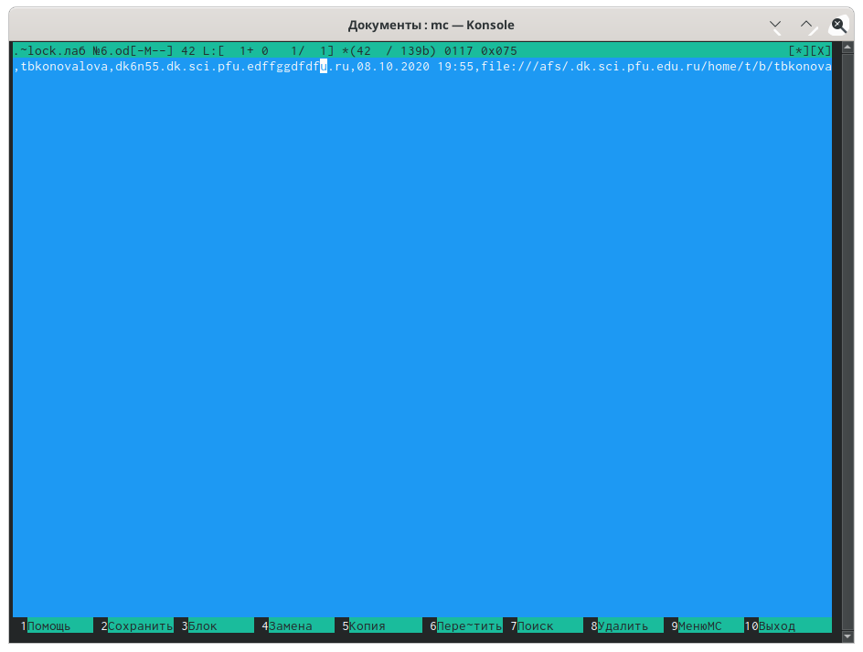

---
## Front matter
lang: ru-RU
title: Отчёт по лабораторной работе №8
author: Коновалова Татьяна Борисовна
institute: РУДН, Москва, Россия

date: 13 Мая 2021

## Formatting
toc: false
slide_level: 2
theme: metropolis
header-includes: 
 - \metroset{progressbar=frametitle,sectionpage=progressbar,numbering=fraction}
 - '\makeatletter'
 - '\beamer@ignorenonframefalse'
 - '\makeatother'
aspectratio: 43
section-titles: true
---

# Отчет по лабораторной работы №8

## Команда mc

Изучила информацию о mc, вызвав в командной строке «man mc» (Алгоритм действий представлен на рис. -@fig:001 ). Midnight Commander (или mc) − псевдографическая командная оболочка для UNIX/Linux систем. Для запуска mc необходимо в командной строке набрать «mc» и нажать«enter».

{ #fig:001 width=70% }

## Изучение команды mc

Запустила из командной строки mc и изучила его структуру и меню. В стандартном состояние окно редактора состоит из двух панелей (Скриншот -@fig:004 ). Верхнее меню содержит меню «Левая панель», «Файл», «Команда», «Настройки», «Правая панель». Нажав клавишу «F2», можно открыть «Меню пользователя». Нажав клавишу «F1», можно открыть «Помощь».

{ #fig:004 width=70% }

## Операции в mc

Копирование/перемещение файлов. Для копирования файла используется клавиша «F5» (иллюстрация на рис. -@fig:014 ).
	
{ #fig:014 width=70% }

## Операции в mc

Редактирование содержимого текстового файла (результаты не сохраняем). Перейдем в пункт «Правка» (Иллюстрация на рис. -@fig:040) и изменим имя файла (Иллюстрация на рис. -@fig:041).

{ #fig:040 width=70% }

{ #fig:041 width=70% }

## Редактирование файла в mc

Открыла файл с исходным текстом на языке программирования С. Открыла файл в редакторе mc с помощью команды «mc» (перед этим выстроила путь к файлу на консоли) (Рисунок -@fig:082 ).

{ #fig:082 width=70% }

## Выводы

В ходе выполнения данной лабораторной работы я освоила основные возможности командной оболочки Midnigh tCommander и приобрела навыки практической работы по просмотру каталогов и файлов; манипуляций с ними.

## {.standout}

Спасибо за внимание!
