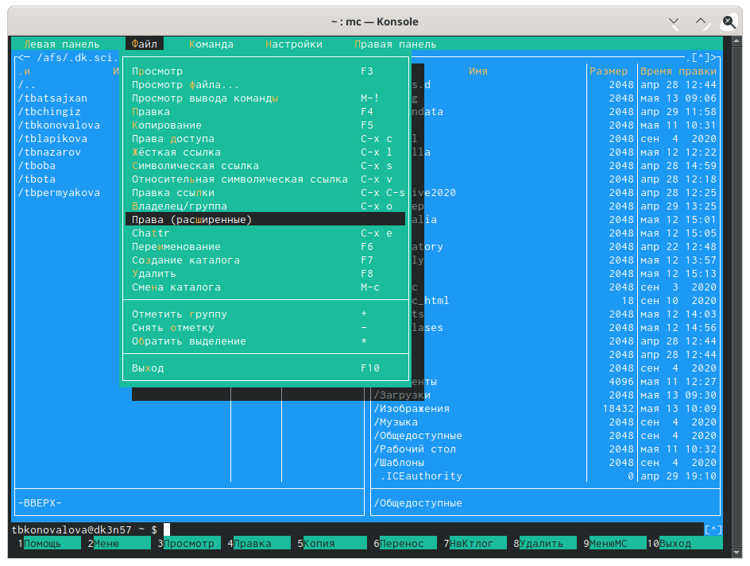

---
# Front matter
lang: ru-RU
title: "Лабораторная работа №8"
subtitle: "Дисциплина: Операционные системы"
author: "Коновалова Татьяна Борисовна"

# Formatting
toc-title: "Содержание"
toc: true # Table of contents
toc_depth: 2
lof: true # List of figures
lot: true # List of tables
fontsize: 12pt
linestretch: 1.5
papersize: a4paper
documentclass: scrreprt
polyglossia-lang: russian
polyglossia-otherlangs: english
mainfont: PT Serif
romanfont: PT Serif
sansfont: PT Sans
monofont: PT Mono
mainfontoptions: Ligatures=TeX
romanfontoptions: Ligatures=TeX
sansfontoptions: Ligatures=TeX,Scale=MatchLowercase
monofontoptions: Scale=MatchLowercase
indent: true
pdf-engine: lualatex
header-includes:
  - \linepenalty=10 # the penalty added to the badness of each line within a paragraph (no associated penalty node) Increasing the value makes tex try to have fewer lines in the paragraph.
  - \interlinepenalty=0 # value of the penalty (node) added after each line of a paragraph.
  - \hyphenpenalty=50 # the penalty for line breaking at an automatically inserted hyphen
  - \exhyphenpenalty=50 # the penalty for line breaking at an explicit hyphen
  - \binoppenalty=700 # the penalty for breaking a line at a binary operator
  - \relpenalty=500 # the penalty for breaking a line at a relation
  - \clubpenalty=150 # extra penalty for breaking after first line of a paragraph
  - \widowpenalty=150 # extra penalty for breaking before last line of a paragraph
  - \displaywidowpenalty=50 # extra penalty for breaking before last line before a display math
  - \brokenpenalty=100 # extra penalty for page breaking after a hyphenated line
  - \predisplaypenalty=10000 # penalty for breaking before a display
  - \postdisplaypenalty=0 # penalty for breaking after a display
  - \floatingpenalty = 20000 # penalty for splitting an insertion (can only be split footnote in standard LaTeX)
  - \raggedbottom # or \flushbottom
  - \usepackage{float} # keep figures where there are in the text
  - \floatplacement{figure}{H} # keep figures where there are in the text
---

# Цель работы

Цель данной лабораторной работы --- Освоение основных возможностей командной оболочки Midnight Commander. Приобретение навыков практической работы по просмотру каталогов и файлов; манипуляций с ними.

# Задание

1. Сделать отчёт по лабораторной работе №8 в формате Markdown.
2. Освоить основные возможности командной оболочки Midnight Commander..

# Выполнение лабораторной работы

1). Изучила информацию о mc, вызвав в командной строке «man mc» (Алгоритм действий представлен на рис. -@fig:001 , -@fig:002). Midnight Commander (или mc) − псевдографическая командная оболочка для UNIX/Linux систем. Для запуска mc необходимо в командной строке набрать «mc» и нажать«enter».

{ #fig:001 width=70% }

{ #fig:002 width=70% }

2). Запустила из командной строки mc и изучила его структуру и меню (алгоритм действий представлен на рис. -@fig:003 , -@fig:004 , -@fig:005 , -@fig:006 , -@fig:007 , -@fig:008 , -@fig:009 , -@fig:010 , -@fig:011 ).В стандартном состояние окно редактора состоит из двух панелей (Скриншот -@fig:004 ). Верхнее меню содержит меню «Левая панель», «Файл», «Команда», «Настройки», «Правая панель» (Рисунки -@fig:005 , -@fig:006 , -@fig:007 , -@fig:008 , -@fig:009 ).Нажав клавишу «F2», можно открыть «Меню пользователя» (Скриншот -@fig:010). Нажав клавишу «F1», можно открыть «Помощь» (Скриншот -@fig:011).

{ #fig:003 width=70% }

{ #fig:004 width=70% }

{ #fig:005 width=70% }

{ #fig:006 width=70% }

{ #fig:007 width=70% }

{ #fig:008 width=70% }

{ #fig:009 width=70% }

{ #fig:010 width=70% }

{ #fig:011 width=70% }

3). Выполнила операции в mc, используя управляющие клавиши 

1. Выделение/отмена выделения файлов. Использую клавишу «ins» и выделяю необходимые файлы (они выделяются желтым цветом) (иллюстрация на рис. -@fig:012 ).

{ #fig:012 width=70% }

Для выделения файлов или его отмены можно использовать также команды «Отметить группу», «Снять отметку», «Обратить выделение» в меню «Файл» (иллюстрация на рис. -@fig:013 ).

{ #fig:013 width=70% }

2. Копирование/перемещение файлов. Для копирования файла используется клавиша «F5» (иллюстрация на рис. -@fig:014 ).
	
{ #fig:014 width=70% }

Для перемещения файла использовала клавишу «F6» (иллюстрация на рис. -@fig:015 ).

{ #fig:015 width=70% }

3. Получение информации о размере и правах доступа на файлы и/или каталоги. Для получения данной информации можно перейти в команды: «Левая панель» → «Информация» (иллюстрация на рис. -@fig:016 , -@fig:017 ).

{ #fig:016 width=70% }

{ #fig:017 width=70% }

«Левая панель» → «Формат списка» → «Расширенный» (иллюстрация на рис. -@fig:018 , -@fig:019 , -@fig:020 ).

{ #fig:018 width=70% }

{ #fig:019 width=70% }

{ #fig:020 width=70% }

«Файл» → «Права доступа» (иллюстрация на рис. -@fig:021 , -@fig:022 ).

{ #fig:021 width=70% }

{ #fig:022 width=70% }

«Файл» → «Права (расширенные)» (иллюстрация на рис. -@fig:023 , -@fig:024 ).

{ #fig:023 width=70% }

{ #fig:024 width=70% }

4). Выполнила основные команды меню правой панели (Скриншот -@fig:025 ).

{ #fig:025 width=70% }

4.1. Пункт «Список файлов» отображает размер файла и время его правки (Скриншот -@fig:026 ).

{ #fig:026 width=70% }

4.2. Пункт «Быстрый просмотр» нужен для предпросмотра содержания файла (Скриншот -@fig:027 ).

{ #fig:027 width=70% }

4.3. Пункт «Информация» отображает подробные данные о файле (См. на рис.  -@fig:028 , -@fig:029).

{ #fig:028 width=70% }

{ #fig:029 width=70% }

4.4. Пункт «Дерево» необходим для просмотра дерева каталога (отображает минимум информации) (Скриншот -@fig:030 ).

{ #fig:030 width=70% }

4.5. Пункт «Формат списка» − «Укороченный» отображает только имя файла или каталога (видна минимальная информация) (Рисунки -@fig:031 , -@fig:032 ).

{ #fig:031 width=70% }

{ #fig:032 width=70% }

4.6. Пункт «Формат списка» − «Расширенный» отображает подробную информацию о файлах, но менее подробную,чем пункт «Информация» (Скриншот -@fig:033 ).

{ #fig:033 width=70% }

4.7. Пункт «Формат списка» − «Определенный пользователем» предоставляетпользователю возможность самому изменять степень подробности информации о файле, но она будет менее подробной, чем в пункте "Информация".

4.8. Пункт «Формат списка» − «Стандартный» ставится по умолчанию (Скриншот -@fig:034 ).

{ #fig:034 width=70% }

4.9. Пункт «Порядок сортировки» необходим для сортировки файлов или каталогов по конкретному критерию (Снимок экрана -@fig:035 ).

{ #fig:035 width=70% }

4.10. Пункт «Фильтр» необходим, чтобы просматривать название файлов или каталогов, которые подходят под указанную маску (Снимок экрана -@fig:036 ).

{ #fig:036 width=70% }

4.11. Пункт "Выбор кодировки" нужен для просмотра и смены кодировки (Снимок экрана -@fig:037 ).

{ #fig:037 width=70% }

5). Используя возможности под меню «Файл» (см. рис. -@fig:038), выполним:

{ #fig:038 width=70% }

5.1. Просмотр содержимого текстового файла. Выберем текстовый файл и перейдем в пункт «Просмотр» (Иллюстрация на рис. 39).

{ #fig:039 width=70% }

5.2. Редактирование содержимого текстового файла (результаты не сохраняем). Перейдем в пункт «Правка» (Иллюстрация на рис. -@fig:040 ) и изменим имя файла (Иллюстрация на рис. -@fig:041 ).

{ #fig:040 width=70% }

{ #fig:041 width=70% }

5.3. Создание каталога. Перешла в пункт «Создание каталога» (Скриншот -@fig:042 ) и создала каталог "abc".

{ #fig:042 width=70% }

5.4. Копирование файлов в созданный каталог. Для этого, используя клавишу «ins», выделила несколько файлов (Скриншот -@fig:043 ).
 
{ #fig:043 width=70% }

После этого выбрав пункт «Копирование», скопируем данные файлы в созданный каталог (алгоритм действий представлен на рис. -@fig:044 , -@fig:045 ).

{ #fig:044 width=70% }

{ #fig:045 width=70% }

6). Используя соответствующие средства под меню «Команда» (Скриншот -@fig:046 ) осуществим:

{ #fig:046 width=70% }

6.1. Поиск в файловой системе файла с заданными условиями. Перешла в пункт «Поиск файла» и задала следующие параметры: «От каталога» /,«Шаблон имени» *.с, «Содержимое» main (см. рис. -@fig:047 ) и осуществила поиск нужных файлов (см. рис. -@fig:048 ). 

{ #fig:047 width=70% }

{ #fig:048 width=70% }

Аналогичным образом найшла файлы с шаблоном имени *.cpp (Рисунки -@fig:049 , -@fig:050 ).

{ #fig:049 width=70% }

{ #fig:050 width=70% }

6.2. Выбор и повторение одной из предыдущих команд. Перешла в пункт «История командной строки» и увидила, что внизу экрана появилась сноска «История», но т.к.командная строка не была использована эта сноска пустая (Рисунок -@fig:051 ).

{ #fig:051 width=70% }

6.3. Переход в домашний каталог. Для перехода в домашний каталог перешла в пункт «Дерево каталогов» (Скриншот -@fig:052 ), выбрала необходимый каталог и нажала «enter», в результате чего, в левой панели перешла в домашний каталог (Скриншот -@fig:053 ).

{ #fig:052 width=70% }

{ #fig:053 width=70% }

6.4. Анализ файла меню и файла расширений. Перешла в пункт «Редактировать файл расширений» (Снимок экрана -@fig:054 ). "Редактировать файл расширений" − позволяет задать с помощью определённого синтаксиса действия при запуске файлов с определённым расширением. Пункт «Редактировать файл меню» − позволяет отредактировать контекстное меню пользователя (Снимоки экрана -@fig:055 , -@fig:056).

{ #fig:054 width=70% }

{ #fig:055 width=70% }

{ #fig:056 width=70% }

7). Вызвала под меню «Настройки» (Скриншот -@fig:057 ).Освоила операции, определяющие структуру экрана mc:

{ #fig:057 width=70% }

7.1. Перешла в пункт «Конфигурация» (Скриншот -@fig:058 ). Этот пункт позволяет скорректировать настройки работы с панелями.

{ #fig:058 width=70% }

7.2. Перешла в пункт «Внешний вид» (иллюстрация на рис. -@fig:059 ) ,а затем в пункт «Настройки панелей» (иллюстрация на рис. -@fig:060 ). Данные пункты определяют элементы (строка меню,командная строка,подсказк и ипрочее), отображаемые при вызове mc,а также геометрию расположения панелей и цветовыделение.

{ #fig:059 width=70% }

{ #fig:060 width=70% }

7.3. Перешла в пункт «Подтверждение» (Рисунок -@fig:061 ).Этот пункт позволяет установить или убрать вывод окна с запросом подтверждения действий при операциях удаления и перезаписи файлов, атакже при выходе из программы.
 
{ #fig:061 width=70% }

7.4. Перешла в пункт «Оформление» (Рисунок -@fig:062 ). Данный пункт позволяет поменять цветовую гамму визуальной оболочки для комфортной работы.
 
{ #fig:062 width=70% }

7.5. Перешла в пункт «Биты символов» (Рисунок -@fig:063 ). Этот пункт задаёт формат обработки информации локальным терминалом.

{ #fig:063 width=70% }

7.6. Перешла в пункт «Распознавание клавиш» (Рисунок -@fig:064 ). Данное диалоговое окно используется для тестирования функциональных клавиш, клавишу правления курсором и прочее.

{ #fig:064 width=70% }

7.7. Перешла в пункт «Виртуальные ФС» (Рисунок -@fig:065 ).Это настройки виртуальной файловой системы: тайм-аут,п ароль и прочее.

{ #fig:065 width=70% }

7.8. Перешла в пункт «Сохранить настройки» (Рисунок -@fig:066 ).Данный пункт сохранит все изменения.

{ #fig:066 width=70% }

Задание 2 (работа с редактором mc)

1). С помощью команды «touch text.txt» создаем текстовой файл text.txt. Командой« ls» проверяем правильность выполненных действий. Открываем этот файл с помощью встроенного mc редактора командой «mcedit text.txt» (Снимоки экрана -@fig:067 , -@fig:068 ).

{ #fig:067 width=70% }

{ #fig:068 width=70% }

2). См. пункт 1 второго задания.

3). Вставила в открытый файл небольшой фрагмент текста, скопированный из Интернета (Рисунок -@fig:069 ).

{ #fig:069 width=70% }

4).Выполним следующие действия:

4.1. Удалим 4-ю строку текста с помощью клавиши «F8» (Рисунки -@fig:070 , -@fig:071).

{ #fig:70 width=70% }

{ #fig:071 width=70% }

4.2. Выделила фрагмент текста, нажав «F3» для начала выделения текста и для его окончания, и скопировала его на новую строку, используя клавишу «F5» (Рисунки -@fig:072 , -@fig:073).

{ #fig:72 width=70% }

{ #fig:073 width=70% }

4.3. Выделила фрагмент текста и перенесла его на новую строку с помощью клавиши «F6» (Рисунок -@fig:074).

{ #fig:074 width=70% }

4.4. Сохранила файл, нажав «F2» (Рисунок -@fig:075).

{ #fig:075 width=70% }

4.5. Отменила последнее действие с помощью сочетания клавиш «ctrl»+«u» (Рисунок -@fig:076 ).

{ #fig:076 width=70% }

4.6. Перешла в конец файла, нажав клавиши «ctrl»+«end» (переход в конец файла) и написала следующий текст «С.А. Есенин» (иллюстрация на рис. -@fig:077 , -@fig:078 ).

{ #fig:077 width=70% }

{ #fig:078 width=70% }

4.7. Перешла в начало файла, нажав клавиши «ctrl»+«home» (переход в начало файла) и написала следующий текст «Стихотворение про осень:» (иллюстрация на рис. -@fig:079 ).

{ #fig:079 width=70% }

4.8. Выполнила сохранение файла (клавиша «F2») и выйдем из него (клавиша «F10») (Рисунок -@fig:080).

{ #fig:080 width=70% }

5). Открыла файл с исходным текстом на языке программирования С. Открыла файл в редакторе mc с помощью команды «mc» (перед этим выстроила путь к файлу на консоли) (Рисунки -@fig:081 , -@fig:082 ).

{ #fig:081 width=70% }

{ #fig:082 width=70% }

6). Используя меню редактора «Команда» → «Включить/выключить подсветку синтаксиса», выключим подсветку синтаксиса (Рисунок -@fig:083).

{ #fig:083 width=70% }

Ответы на контрольные вопросы:

1) Панели могут дополнительно быть переведены в один из двух режимов: «Информация» или «Дерево». В режиме «Информация» на панель выводятся сведения о файле и текущей файловой системе, расположенных на активной панели. В режиме «Дерево» на одной из панелей выводится структура дерева каталогов.

2) Как с помощью команд shell, так и с помощью меню (комбинаций клавиш) mc можно выполнить следующие операции с файлами:

- копирование «F5» («cp имя_файла имя_каталога (в который копируем)») (Рисунок14)

- перемещение/переименование «F6» («mv имя_файла имя_каталога (в который перемещаем)»)(Рисунок15)

- создание каталога «F7» («mkdir имя_каталога»)(Рисунок38)

- удаление «F8» («rm имя_файла»)

- изменение прав доступа «ctrl+x» («chmod u+x имя_файла»)

3) Перейти в строку меню панелей mc можно с помощью функциональной клавиши «F9». В строке меню имеются пять меню: «Леваяпанель», «Файл», «Команда», «Настройки» и «Праваяпанель».

Под пункт меню «Быстрый просмотр» позволяет выполнить быстрый просмотр содержимого панели.

Подпункт меню «Информация» позволяет посмотреть информацию о файле или каталоге. В меню каждой (левой или правой) панели можно выбрать «Формат списка»:

- стандартный − выводит список файлов и каталогов с указанием размера и времени правки;

- ускоренный − позволяет задать число столбцов, на которые разбивается панель при выводе списка имён файлов или каталогов без дополнительной информации;

- расширенный − помимо названия файла или каталога выводит сведения о правах доступа, владельце, группе, размере, времени правки;

- определённый пользователем − позволяет вывести те сведения о файле или каталоге, которые задаст сам пользователь.

Подпункт меню «Порядок сортировки» позволяет задать критерии сортировки при выводе списка файлов и каталогов: без сортировки, по имени, расширенный, время правки, время доступа, время изменения атрибута, размер, узел.

4) Команды меню «Файл»:

- Просмотр(«F3»)− позволяет посмотреть содержимое текущего (или выделенного) файла без возможности редактирования.

- Просмотр вывода команды («М»+«!»)− функция запроса команды с параметрами (аргумент к текущему выбранному файлу).

- Правка(«F4») − открывает текущий (или выделенный) файл для его редактирования.

- Копирование(«F5»)− осуществляет копирование одного или нескольких файлов или каталогов в указанное пользователем во всплывающем окне место.

- Права доступа («Ctrl-x»«c»)− позволяет указать (изменить) права доступа к одному или нескольким файлам или каталогам.

- Жёсткая ссылка («Ctrl-x»«l»)− позволяет создать жёсткую ссылку к текущему(или выделенному) файлу.

- Символическая ссылка («Ctrl-x»«s»)− позволяет создать символическую ссылку к текущему (или выделенному) файлу.

- Владелец/группа («Ctrl-x»«o»)− позволяет задать (изменить) владельца и имя группы для одного или нескольких файлов или каталогов.

- Права(расширенные)− позволяет изменить права доступа и владения для одного или нескольких файлов или каталогов.

- Переименование («F6»)− позволяет переименовать (или переместить) один или несколько файлов или каталогов.

- Создание каталога («F7») − позволяет создать каталог.

- Удалить («F8») − позволяет удалить один или несколько файлов или каталогов.

- Выход («F10») − завершает работу mc.

5) Меню Команда

В меню Команда содержатся более общие команды для работы с mc.

Команды меню Команда:

- Дерево каталогов − отображает структуру каталогов системы.

- Поиск файла − выполняет поиск файлов по заданным параметрам.

- Переставить панели − меняет местами левую и правую панели.

- Сравнить каталоги («Ctrl-x»«d») − сравнивает содержимое двух каталогов.

- Размеры каталогов − отображает размер и время изменения каталога (по умолчанию в mc размер каталога корректно не отображается).

- История командной строки − выводит на экран список ранее выполненных в оболочке команд.

- Каталоги быстрого доступа(Ctrl-\»)− при вызове выполняется быстрая смена текущего каталога на один из заданного списка.

- Восстановление файлов − позволяет восстановить файлы на файловых системах ext2 и ext3.

- Редактировать файл расширений − позволяет задать с

Елизавета Пермякова, вчера в 20:21
помощью определённого синтаксиса действия при запуске файлов с определённым расширением (например, какое программное обеспечение запускать для открытия или редактирования файлов с расширением doc или docx).

- Редактировать файл меню − позволяет отредактировать контекстное меню пользователя, вызываемое по клавише «F2».

- Редактировать файл расцветки имён − позволяет подобрать оптимальную для пользователя расцветку имён файлов в зависимости от их типа.

6) Меню Настройки содержит ряд дополнительных опций по внешнему виду и функциональности mc.

Меню Настройки содержит:

- Конфигурация − позволяет скорректировать настройки работы с панелями.

- Внешний вид и Настройки панелей − определяет элементы (строка меню, командная строка, подсказки и прочее), отображаемые при вызове mc, а также геометрию расположения панелей и цветовыделение.

- Биты символов − задаёт формат обработки информации локальным терминалом.

- Подтверждение − позволяет установить или убрать вывод окна с запросом подтверждения действий при операциях удаления и перезаписи файлов, а также при выходе из программы.

- Распознание клавиш − диалоговое окно используется для тестирования функциональных клавиш, клавиш управления курсором и прочее.

- Виртуальные ФС − настройки виртуальной файловой системы: тайм-аут, пароль и прочее.

7) Функциональные клавиши mc:

- F1 – вызов контекстно-зависимой подсказки

- F2 – вызов пользовательского меню с возможностью создания и/или дополнения дополнительных функций

- F3 – просмотр содержимого файла, на который указывает подсветка в активной панели (без возможности редактирования)

- F4 – вызов встроенного в mc редактора для изменения содержания файла, на который указывает подсветка в активной панели

- F5 – копирование одного или нескольких файлов, отмеченных впервой (активной) панели, в каталог, отображаемый на второй панели

- F6 – перенос одного или нескольких файлов, отмеченных в первой (активной) панели, в каталог, отображаемый на второй панели

- F7 – создание подкаталога в каталоге, отображаемом в активной панели

- F8 – удаление одного или нескольких файлов (каталогов), отмеченных в первой (активной) панели файлов

- F9 – вызов меню mc

- F10 – выход из mc

8) Встроенный в mc редактор вызывается с помощью функциональной клавиши «F4». В нём удобно использовать различные комбинации клавиш при редактировании содержимого (как правило текстового) файла. Клавиши для редактирования файла:

- «Ctrl-y» − удалить строку

- «Ctrl-u» − отмена последней операции

- «ins» - вставка/замена

- «F7» − поиск (можно использовать регулярные выражения)

- «↑-F7» − повтор последней операции поиска

- «F4» − замена

- «F3» − первое нажатие − начало выделения, второе − окончание выделения

- «F5» − копировать выделенный фрагмент

- «F6» − переместить выделенный фрагмент

- «F8» − удалить выделенный фрагмент

- «F2» − записать изменения в файл

- «F10» − выйти из редактор

9) Для редактирования меню пользователя, которое вызывается клавишей «F2», необходимо перейти в пункт «Редактировать файл меню» → «Команда» и изменить настройки файла.

10) Часть команд «Меню пользователя», а также меню «Файл» позволяют выполнять действия, определяемые пользователем, над текущим файлом. Например, копирование каталога или файла, переименование, перемещение, архивирование.

# Выводы

В ходе выполнения данной лабораторной работы я освоила основные возможности командной оболочки Midnigh tCommander и приобрела навыки практической работы по просмотру каталогов и файлов; манипуляций с ними.
