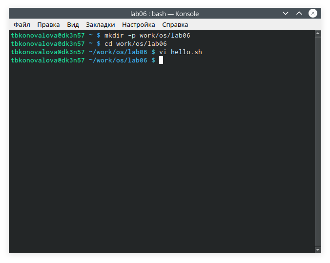
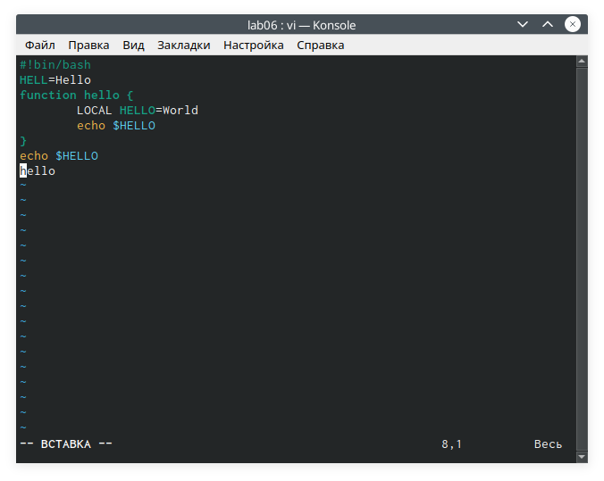
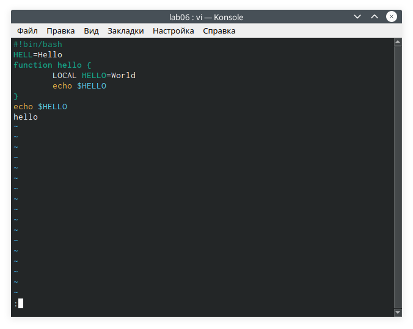
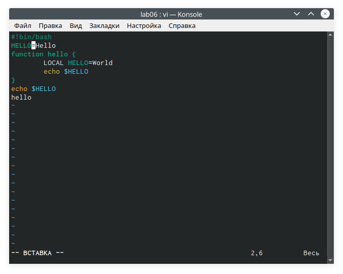
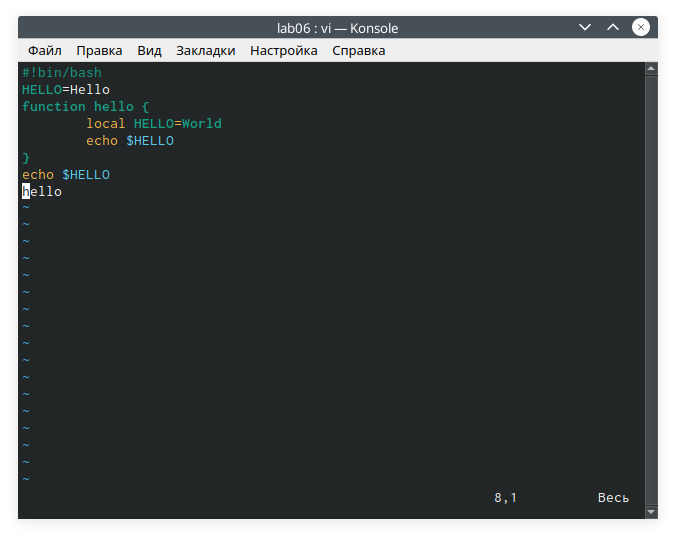

---
## Front matter
lang: ru-RU
title: Отчёт по лабораторной работе №9
author: Коновалова Татьяна Борисовна
institute: РУДН, Москва, Россия

date: 18 Мая 2021

## Formatting
toc: false
slide_level: 2
theme: metropolis
header-includes: 
 - \metroset{progressbar=frametitle,sectionpage=progressbar,numbering=fraction}
 - '\makeatletter'
 - '\beamer@ignorenonframefalse'
 - '\makeatother'
aspectratio: 43
section-titles: true
---

# Отчет по лабораторной работы №9

## Создание каталога

Создала каталог с именем ~/work/os/lab06 с помощью команды mkdir (Алгоритм действий представлен на рис. -@fig:001 ). 

{ #fig:001 width=70% }

## Работа с текстом в редакторе

Нажимаем клавишу «i» и вводим текст, указанный в лабораторной работе (Скриншот -@fig:003 ).

{ #fig:003 width=70% }

## Работа с текстом в редакторе

Нажимаем «:» для перехода в режим последней строки, появилось приглашение в виде двоеточия (Скриншот -@fig:005 ).

{ #fig:005 width=70% }

## Работа с текстом в редакторе

Перешла в режим вставки, нажав на клавишу «i», и заменила HELL на HELLO, дописав O (См. рисунок -@fig:011 ).

{ #fig:011 width=70% }

## Работа с текстом в редакторе

Удалила последнюю  строку,  используя  комбинацию  клавиш «d» и «d» (См. рисунок -@fig:016 ).

{ #fig:016 width=70% }

## Выводы

В ходе лабораторной работы я познакомилась с операционной системой Linux. Получила практические навыки работы с редактором vi, установленным по умолчанию практически во всех дистрибутивах.

## Библиография

1. Программное обеспечение GNU/Linux. Лекция 2. Терминал и командная строка (Г. Курячий, МГУ);

2. Программное обеспечение GNU/Linux. Лекция 3. FHS и процессы (Г. Курячий, МГУ);

3. Электроннный ресурс: https://docs.altlinux.org/ru-RU/archive/2.3/html-single/junior/alt-docs-extras-linuxnovice/ch02s10.html 

4. Электронный ресурс: https://remoteshaman.com/unix/common/polnaya-reference-at-vi-redaktoru 

## {.standout}

Спасибо за внимание!
