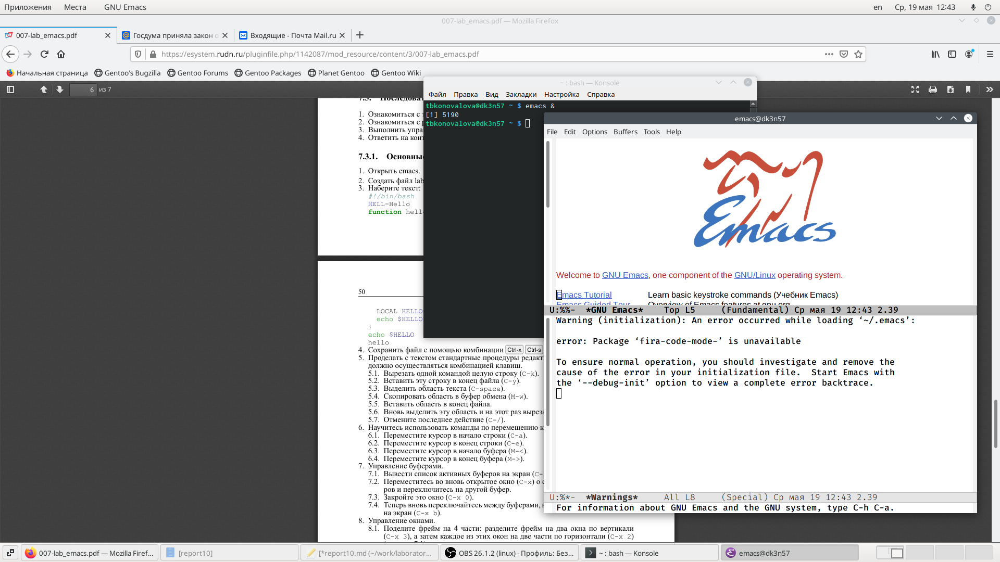
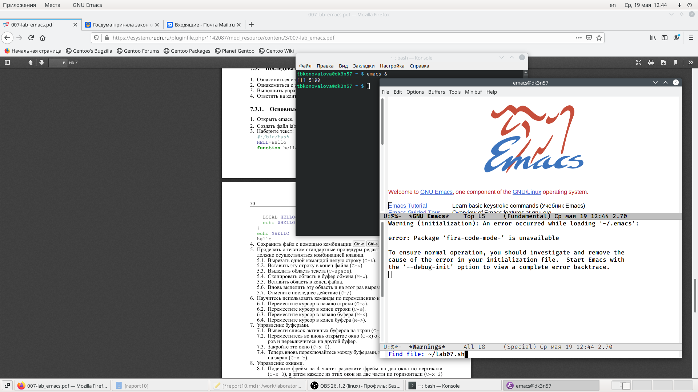
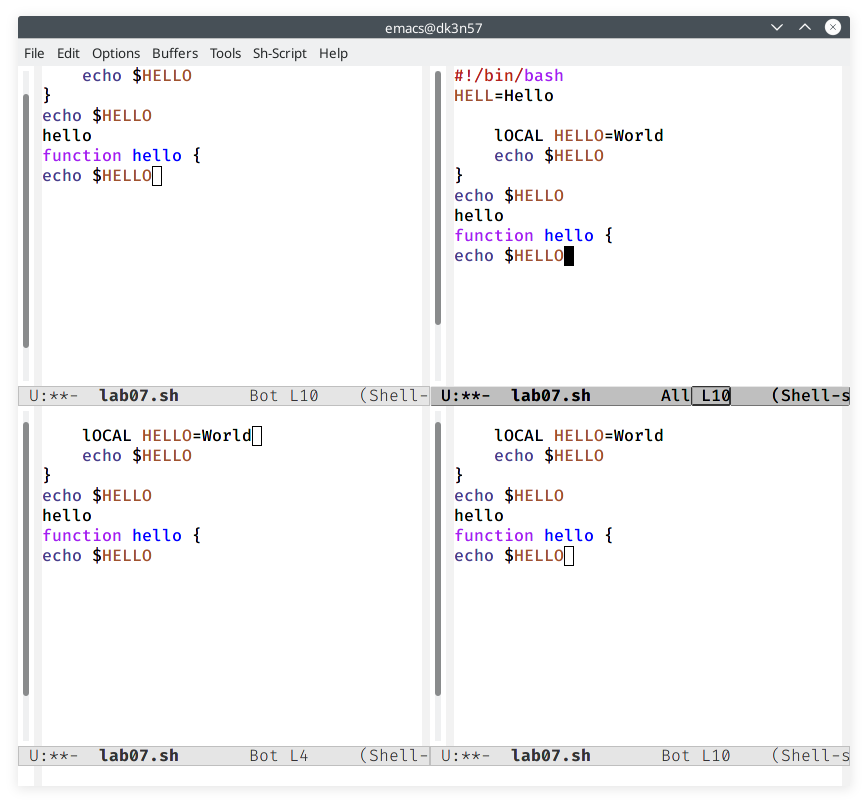
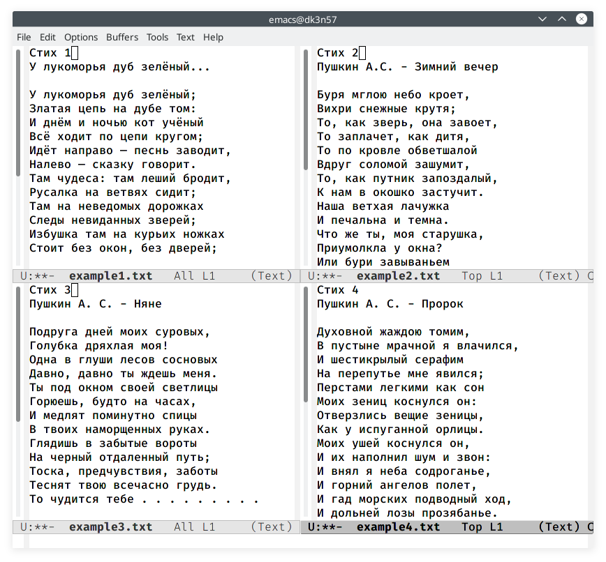
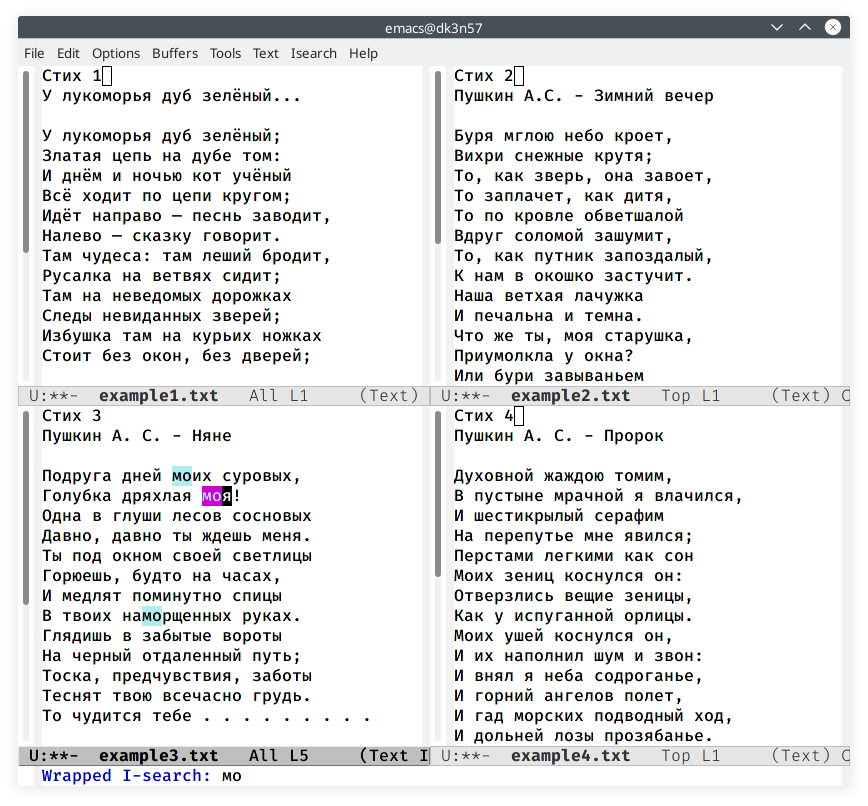

---
## Front matter
lang: ru-RU
title: Отчёт по лабораторной работе №10
author: Коновалова Татьяна Борисовна
institute: РУДН, Москва, Россия

date: 19 Мая 2021

## Formatting
toc: false
slide_level: 2
theme: metropolis
header-includes: 
 - \metroset{progressbar=frametitle,sectionpage=progressbar,numbering=fraction}
 - '\makeatletter'
 - '\beamer@ignorenonframefalse'
 - '\makeatother'
aspectratio: 43
section-titles: true
---

# Отчет по лабораторной работы №10

## Редактор Emacs

 Открыла редактор Emacs с помощью команды «emacs &» (Скриншот -@fig:001 ).

{ #fig:001 width=70% }

## Редактор Emacs

Создала файл lab07.sh с помощью комбинации «Ctrl-x» «Ctrl-f» (Скриншот -@fig:002 ).

{ #fig:002 width=70% }

## Работа с фреймом

 Поделила фрейм  на  4  части (команда «Ctrl-x 3») (Скриншот -@fig:023 ).
 
{ #fig:023 width=70% }

## Режим поиска

Переключилась в режим поиска («Ctrl-s») (см. рис. -@fig:027 ).

{ #fig:027 width=70% }

## Режим поиска

 Переключилась между результатами поиска (Скриншот -@fig:029 ).

{ #fig:029 width=70% }

## Выводы

В ходе выполнения данной лабораторной работы я познакомилась с операционной системой Linux и получила практические навыки работы с редактором Emacs.

## Библиография

1. Программное обеспечение GNU/Linux. Лекция 2. Терминал и командная строка (Г. Курячий, МГУ);

2. Программное обеспечение GNU/Linux. Лекция 3. FHS и процессы (Г. Курячий, МГУ);

3. Электронный ресурс: https://alexott.net/ru/writings/altlinux-emacs/

4. Электронный ресурс: https://yandex.ru/turbo/pythonist.ru/s/tekstovyj-redaktor-emacs/ 

## {.standout}

Спасибо за внимание!
