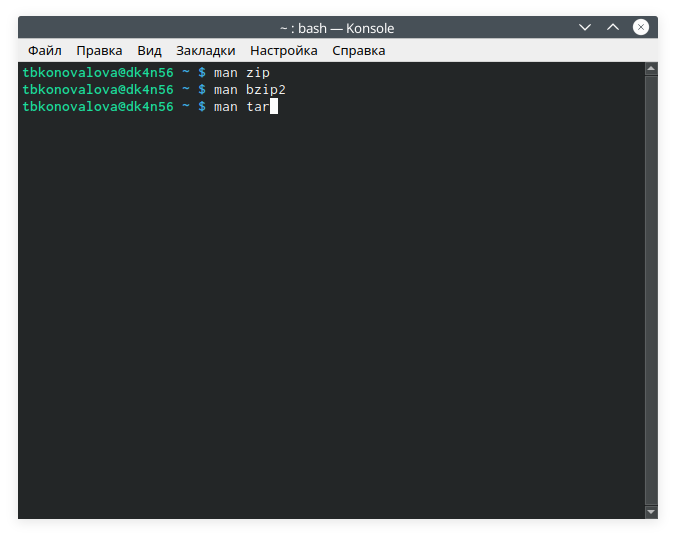

---
## Front matter
lang: ru-RU
title: Отчёт по лабораторной работе №11
author: Коновалова Татьяна Борисовна
institute: РУДН, Москва, Россия

date: 25 Мая 2021

## Formatting
toc: false
slide_level: 2
theme: metropolis
header-includes: 
 - \metroset{progressbar=frametitle,sectionpage=progressbar,numbering=fraction}
 - '\makeatletter'
 - '\beamer@ignorenonframefalse'
 - '\makeatother'
aspectratio: 43
section-titles: true
---

# Отчет по лабораторной работы №11

## Работа с консолью

Для начала я изучила команды архивации, используя команды «manzip», «manbzip2», «mantar» (Скриншот -@fig:001 ).

{ #fig:001 width=70% }

## Архиватор zip

Синтаксис команды zip для разархивации/распаковки файла: unzip [опции] [файл_архива.zip][файлы]-x[исключить]-d[папка] (Скриншот -@fig:002 ).

{ #fig:002 width=70% }

## Архиватор bzip2

Синтаксис команды bzip2 для разархивации/распаковки файла: bunzip2[опции] [архивы.bz2] (Скриншот -@fig:003 ).

{ #fig:003 width=70% }

## Скрипт №1

Cкрипт, при запуске делающий копию самого себя (См. рис. -@fig:006 ).

{ #fig:006 width=70% }

## Скрипт №4

Написала командный файл, получающий в качестве аргумента командной строки формат файла (См. рис. -@fig:021).

{ #fig:021 width=70% }

## Выводы

В ходе выполнения данной лабораторной работы я изучила основы программирования в оболочке ОС UNIX/Linuxи научилась писать небольшие командные файлы.

## Библиография

1. Программное обеспечение GNU/Linux. Лекция 3. FHS и процессы (Г. Курячий, МГУ);

2. Программное обеспечение GNU/Linux. Лекция 4. Права доступа (Е. Алёхова, МГУ);

3. Электронный ресурс: https://ru.wikibooks.org/wiki %D0%92%D0%B2%D0%B5%D0%B4%D0%B5%D0%BD%D0%B8%D0%B5_%D0%B2_%D0%B0%D0%B4%D0%BC%D0%B8%D0%BD%D0%B8%D1%81%D1%82%D1%80%D0%B8%D1%80%D0%BE%D0%B2%D0%B0%D0%BD%D0%B8%D0%B5_UNIX/%D0%9A%D0%BE%D0%BC%D0%B0%D0%BD%D0%B4%D0%BD%D0%B0%D1%8F_%D1%81%D1%82%D1%80%D0%BE%D0%BA%D0%B0_UNIX

4. Электронный ресурс: http://fedoseev.net/materials/courses/admin/ch02.html

## {.standout}

Спасибо за внимание!
