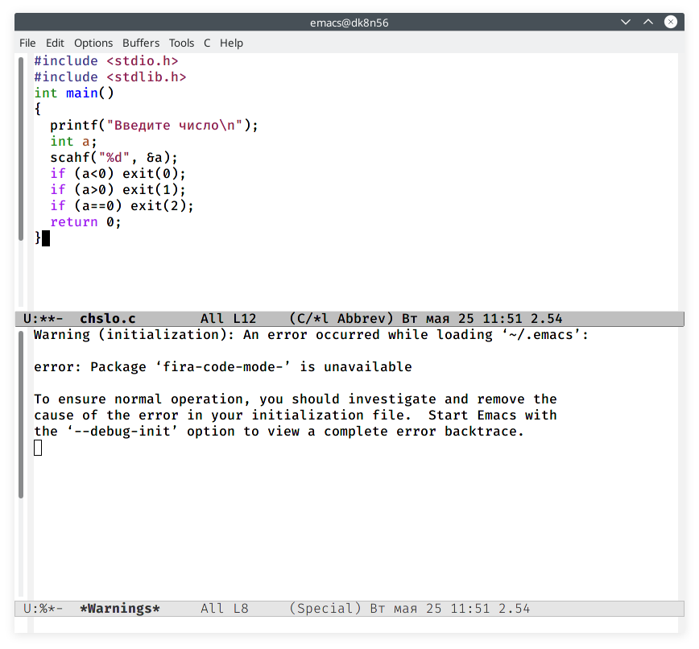
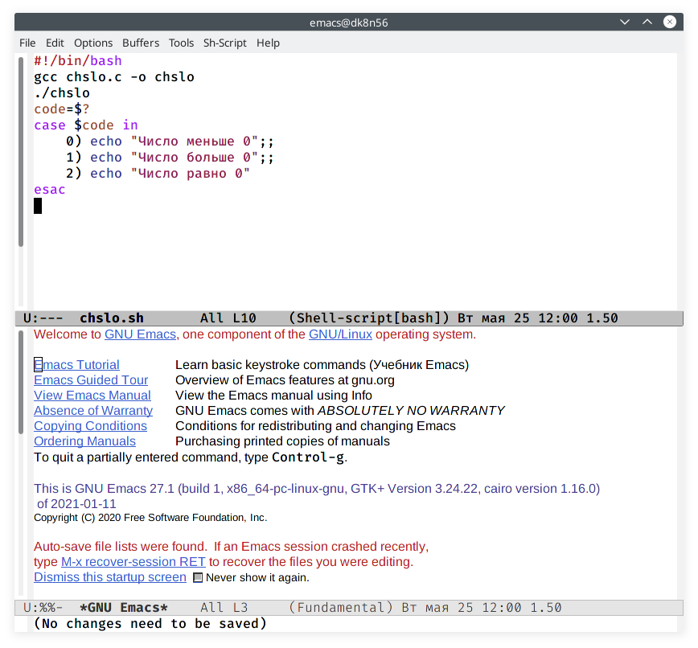
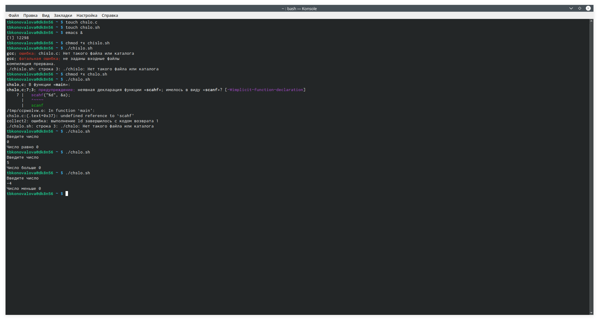
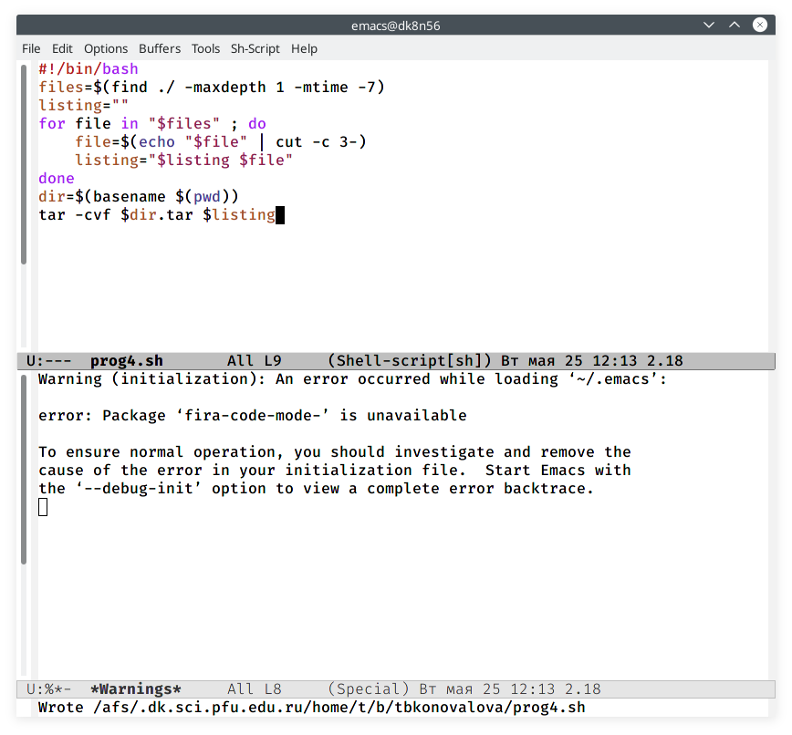

---
## Front matter
lang: ru-RU
title: Отчёт по лабораторной работе №12
author: Коновалова Татьяна Борисовна
institute: РУДН, Москва, Россия

date: 25 Мая 2021

## Formatting
toc: false
slide_level: 2
theme: metropolis
header-includes: 
 - \metroset{progressbar=frametitle,sectionpage=progressbar,numbering=fraction}
 - '\makeatletter'
 - '\beamer@ignorenonframefalse'
 - '\makeatother'
aspectratio: 43
section-titles: true
---

# Отчет по лабораторной работы №12

## Команды getopts grep

Используя команды getopts grep, написала командный файл, который анализирует командную строку с ключами: 

1. -iinputfile—прочитать данные из указанного файла; 

2. -ooutputfile—вывести данные в указанный файл; 

3. -p шаблон —указать шаблон для поиска; 

4. -C—различать большие и малые буквы; 

5. -n—выдавать номера строк,а затем ищет в указанном файле нужные строки, определяемые ключом –p.

## Программа на языке Си

Написала на языке Си программу, которая вводит число и определяет, является  ли  оно  больше  нуля,  меньше  нуля  или  равно  нулю.  (Скриншоты -@fig:006  ).

{ #fig:006 width=70% }

## Скрипт к программе

Написала соответствующий скрипт к программе (Скриншоты -@fig:007 ).

{ #fig:007 width=70% }

## Проверка работы скрипта

Проверила работу написанных скриптов (команда «./chislo.sh») (Рисунок -@fig:008 ).

{ #fig:008 width=70% }

## Скрипт для работы с командой tar

 Модифицировала командный файл (См. рис. -@fig:013 ).

{ #fig:013 width=70% }

## Выводы

В ходе выполнения данной лабораторной работы я изучила основы программирования в оболочке ОС UNIX/Linuxи научилась писать небольшие командные файлы.

## Библиография

1. Программное обеспечение GNU/Linux. Лекция 3. FHS и процессы (Г. Курячий, МГУ);

2. Программное обеспечение GNU/Linux. Лекция 4. Права доступа (Е. Алёхова, МГУ);

3. Программное обеспечение GNU/Linux. Лекция 6. ПО не из хранилища дистрибутива (Г. Курячий, МГУ)

3. Электронный ресурс: https://www.skleroznik.in.ua/2013/07/31/cikly-i-vetvleniya/

4. Электронный ресурс: https://www.opennet.ru/docs/RUS/bash_scripting_guide/c4875.html

## {.standout}

Спасибо за внимание!
