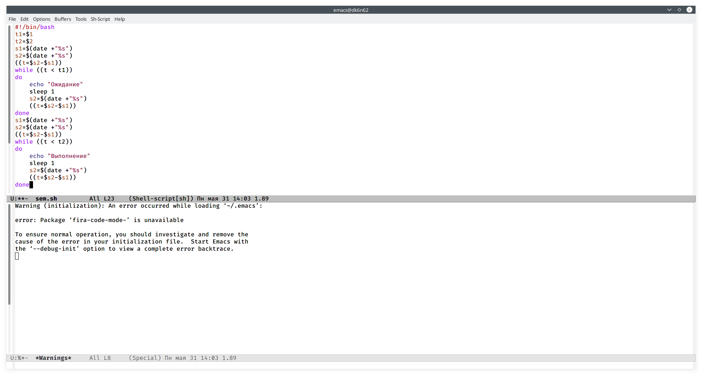
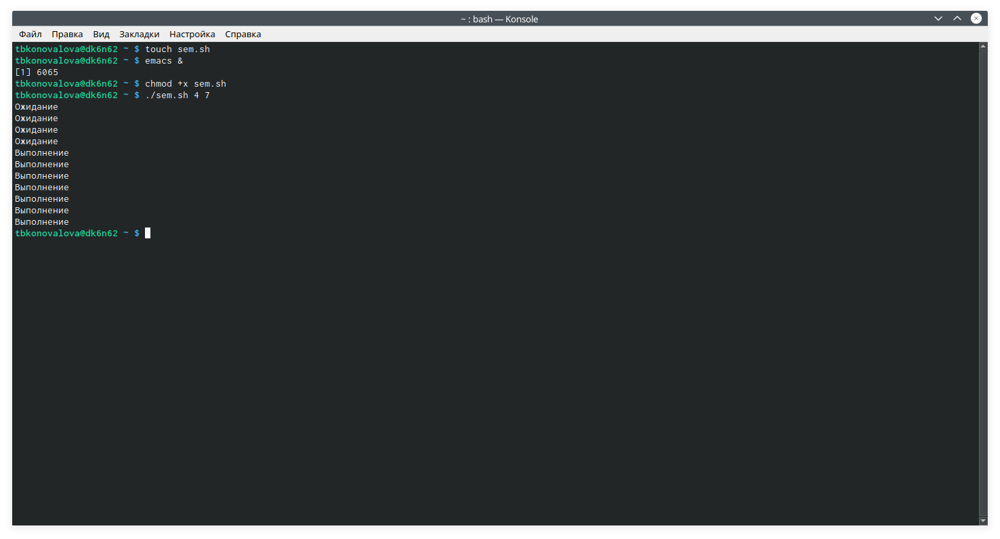
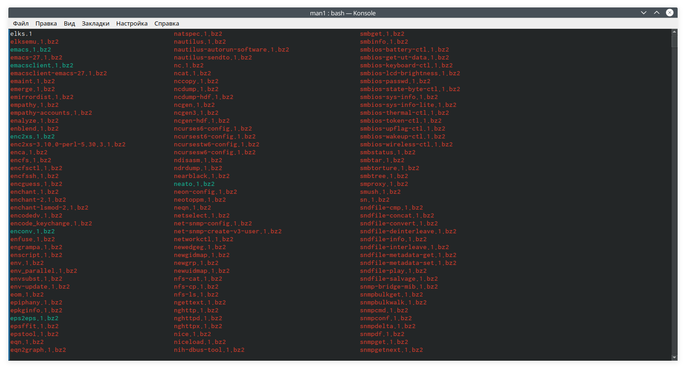
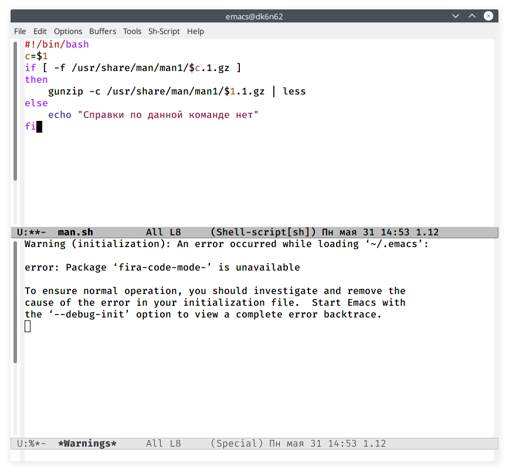
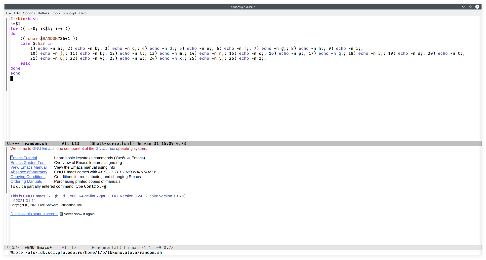

---
## Front matter
lang: ru-RU
title: Отчёт по лабораторной работе №13
author: Коновалова Татьяна Борисовна
institute: РУДН, Москва, Россия

date: 31 Мая 2021

## Formatting
toc: false
slide_level: 2
theme: metropolis
header-includes: 
 - \metroset{progressbar=frametitle,sectionpage=progressbar,numbering=fraction}
 - '\makeatletter'
 - '\beamer@ignorenonframefalse'
 - '\makeatother'
aspectratio: 43
section-titles: true
---

# Отчет по лабораторной работы №13

## Скрипт №1

Написала командный файл, реализующий упрощённый механизм семафоров (Рисунок -@fig:002 ).

{ #fig:002 width=70% }

## Проверка работы скрипта №1

Далее я проверила работу написанного скрипта (команда«./sem.sh47») (Скриншот -@fig:003 ). 

{ #fig:003 width=70% }

## Реализация команды man

Реализовала команду man с помощью командного файла (Рисунок -@fig:007 ). 

{ #fig:007 width=70% }

## Скрипт №2

Скрпт, открывающий архивы текстовых  файлов, содержащих справку по большинству установленных в системе программ и команд (Рисунок -@fig:010 ).

{ #fig:010 width=70% }

## Скрипт №3

Используя встроенную переменную $RANDOM, написала командный файл,  генерирующий случайную последовательность букв латинского алфавита (Рисунок -@fig:013 ).

{ #fig:013 width=70% }

## Выводы

В ходе выполнения данной лабораторной работы я изучила основы программирования в оболочке ОС UNIX и научилась писать более сложные командные файлы с использованием логических управляющих конструкций и циклов.

## Библиография

1. Программное обеспечение GNU/Linux. Лекция 7. Вопросы лицензирования (Г. Курячий, МГУ);

2. Программное обеспечение GNU/Linux. Лекция 9. Хранилище и дистрибутив (Г. Курячий, МГУ);

3. Программное обеспечение GNU/Linux. Лекция 10. Минимальный набор знаний (Г. Курячий, МГУ);

3. Электронный ресурс: https://infopedia.su/24x10498.html

4. Электронный ресурс: http://5fan.ru/wie

## {.standout}

Спасибо за внимание!
