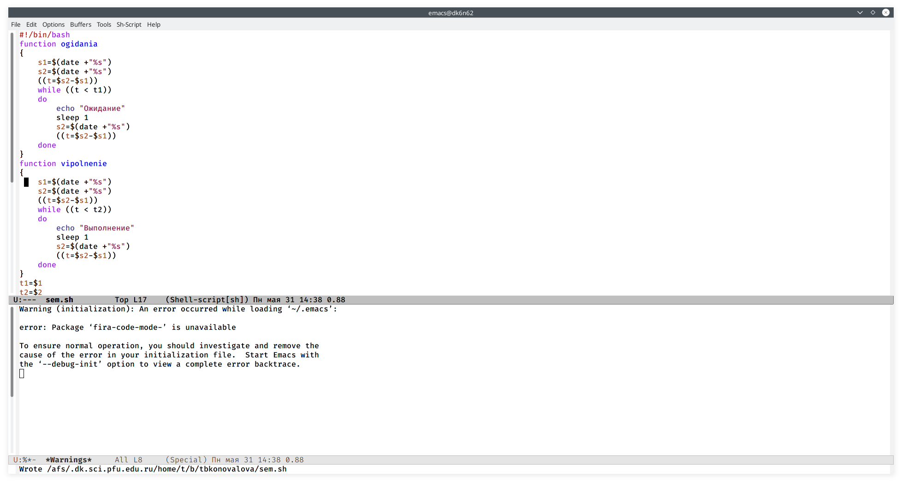
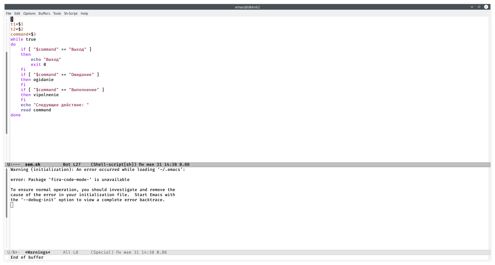
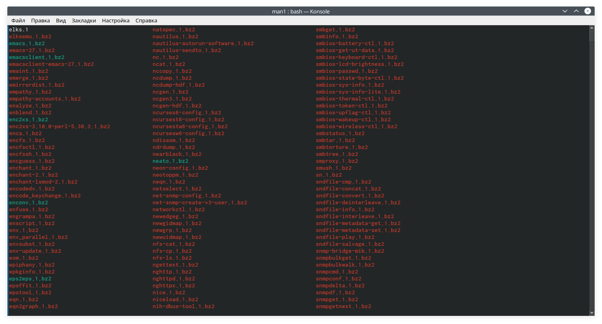
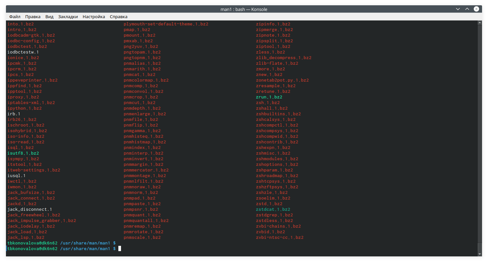
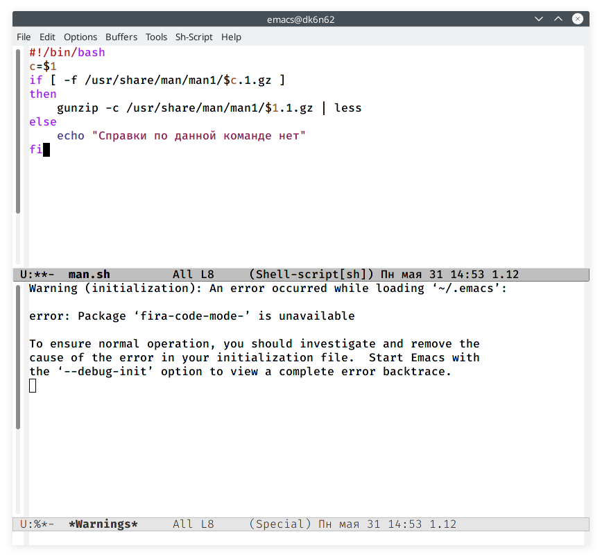
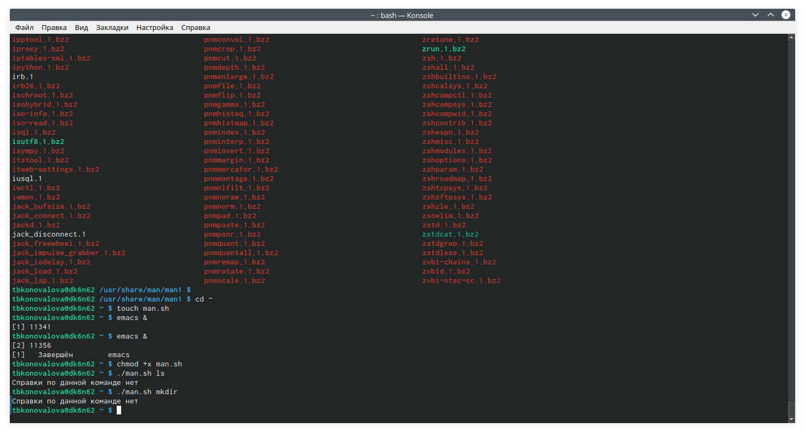
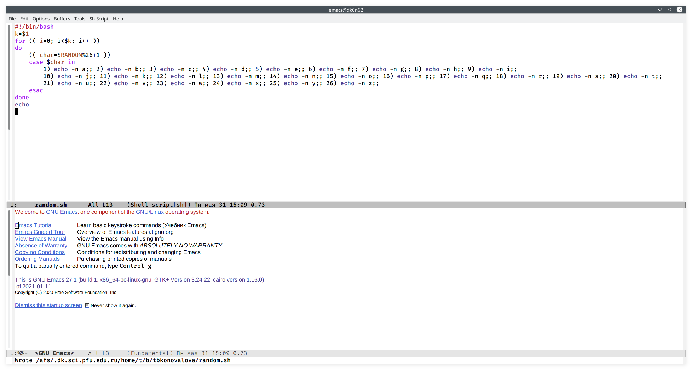

---
# Front matter
lang: ru-RU
title: "Лабораторная работа №13"
subtitle: "Дисциплина: Операционные системы"
author: "Коновалова Татьяна Борисовна"

# Formatting
toc-title: "Содержание"
toc: true # Table of contents
toc_depth: 2
lof: true # List of figures
lot: true # List of tables
fontsize: 12pt
linestretch: 1.5
papersize: a4paper
documentclass: scrreprt
polyglossia-lang: russian
polyglossia-otherlangs: english
mainfont: PT Serif
romanfont: PT Serif
sansfont: PT Sans
monofont: PT Mono
mainfontoptions: Ligatures=TeX
romanfontoptions: Ligatures=TeX
sansfontoptions: Ligatures=TeX,Scale=MatchLowercase
monofontoptions: Scale=MatchLowercase
indent: true
pdf-engine: lualatex
header-includes:
  - \linepenalty=10 # the penalty added to the badness of each line within a paragraph (no associated penalty node) Increasing the value makes tex try to have fewer lines in the paragraph.
  - \interlinepenalty=0 # value of the penalty (node) added after each line of a paragraph.
  - \hyphenpenalty=50 # the penalty for line breaking at an automatically inserted hyphen
  - \exhyphenpenalty=50 # the penalty for line breaking at an explicit hyphen
  - \binoppenalty=700 # the penalty for breaking a line at a binary operator
  - \relpenalty=500 # the penalty for breaking a line at a relation
  - \clubpenalty=150 # extra penalty for breaking after first line of a paragraph
  - \widowpenalty=150 # extra penalty for breaking before last line of a paragraph
  - \displaywidowpenalty=50 # extra penalty for breaking before last line before a display math
  - \brokenpenalty=100 # extra penalty for page breaking after a hyphenated line
  - \predisplaypenalty=10000 # penalty for breaking before a display
  - \postdisplaypenalty=0 # penalty for breaking after a display
  - \floatingpenalty = 20000 # penalty for splitting an insertion (can only be split footnote in standard LaTeX)
  - \raggedbottom # or \flushbottom
  - \usepackage{float} # keep figures where there are in the text
  - \floatplacement{figure}{H} # keep figures where there are in the text
---

# Цель работы

Цель данной лабораторной работы --- Изучить основы программирования в оболочке ОС UNIX. Научиться писать более сложные командные файлы с использованием логических управляющих конструкций и циклов.

# Задание

1. Сделать отчёт по лабораторной работе №13 в формате Markdown.
2. Научиться писать более сложные командные файлы с использованием логических управляющих конструкций и циклов.

# Выполнение лабораторной работы

1). Написала командный файл, реализующий упрощённый механизм семафоров. Командный файл должен в течение некоторого времени t1 дожидаться освобождения ресурса, выдавая об этом сообщение, а дождавшись  его  освобождения,  использовать  его  в  течение некоторого времени t2<>t1, также выдавая информацию о том, что ресурс используется соответствующим командным файлом (процессом). Для данной задачи я создала файл: sem.sh (Рисунки -@fig:001 ) и написала соответствующий скрипт (алгоритм действий представлен на рис. -@fig:002 ).

{ #fig:001 width=70% }

{ #fig:002 width=70% }

Далее я проверила работу написанного скрипта (команда«./sem.sh47»), предварительно добавив право на исполнение файла (команда «chmod+xsem.sh») (Скриншот -@fig:003 ). Скрипт работает корректно.

{ #fig:003 width=70% }

После этого я изменила скрипт так, чтобы его можно было выполнять в нескольких терминалах и проверила  его  работу (например,  команда «./sem.sh2 3 Ожидание > /dev/pts/1 &») (алгоритм действий представлен на рис. -@fig:004 , -@fig:005 , -@fig:006 ). Однако у меня не получилось проверить работу скрипта, так как было отказно в доступе. 

{ #fig:004 width=70% }

{ #fig:005 width=70% }

{ #fig:006 width=70% }

2). Реализовала команду man с помощью командного файла. Изучила содержимое  каталога  /usr/share/man/man1 (Рисунки -@fig:007 , -@fig:008 ). В нем находятся архивы текстовых  файлов, содержащих справку по большинству установленных в системе программ и команд. Каждый архив  можно  открыть  командой less сразу же просмотрев содержимое  справки.  Командный  файл  должен  получать в виде аргумента командной строки название команды и в виде результата выдавать справку об  этой  команде  или  сообщение  об  отсутствии справки, если соответствующего файла нет в каталоге man1. 

{ #fig:007 width=70% }

{ #fig:008 width=70% }

Для данной задачи я создала файл: man.sh (Рисунки -@fig:009 ) и написала соответствующий скрипт. 

{ #fig:009 width=70% }

Далее я проверила работу написанного скрипта (команды«./man.shls»и «./man.sh mkdir»), предварительно добавив  право  на  исполнение  файла (команда «chmod +x man.sh») (Скриншот -@fig:010 ). Скрипт работает корректно.

{ #fig:010 width=70% }

{ #fig:011 width=70% }

3). Используя встроенную переменную $RANDOM, написала командный файл,  генерирующий случайную последовательность букв латинского алфавита. Для данной задачи я создала файл: random.sh (Рисунок -@fig:012 ) и написала соответствующий скрипт (Рисунки -@fig:013 ).

{ #fig:012 width=70% }

{ #fig:013 width=70% }

Далее я проверила работу написанного скрипта (команды «./random.sh 7»и «./random.sh 15»), предварительно  добавив  право  на  исполнение  файла (команда «chmod +x random.sh») (Скриншот -@fig:014 ). Скрипт работает корректно.

{ #fig:014 width=70% }

Контрольные вопросы:

1). while [$1 != "exit"]

В данной строчке допущены следующие ошибки:

- не хватает пробелов после первой скобки [и перед второй скобкой ]

- выражение $1 необходимо взять в “”, потому что эта переменная может содержать пробелы.

Таким образом, правильный вариант должен выглядеть так: while [“$1”!= "exit"]

2). Чтобы объединить несколько строк в одну, можно воспользоваться несколькими способами:

- Первый:

VAR1="Hello,

"VAR2=" World"

VAR3="$VAR1$VAR2"

echo "$VAR3"

Результат: Hello, World

- Второй:

VAR1="Hello, "

VAR1+=" World"

echo "$VAR1"

Результат: Hello, World

3). Команда seq в Linux используется для генерации чисел от ПЕРВОГО до ПОСЛЕДНЕГО шага INCREMENT.

Параметры:

- seq LAST: если задан только один аргумент, он создает числа от 1 до LAST с шагом шага, равным 1. Если LAST меньше 1, значение is не выдает.

- seq FIRST LAST: когда заданы два аргумента, он генерирует числа от FIRST до LAST с шагом 1, равным 1. Если LAST меньше FIRST, он не выдает никаких выходных данных.

- seq FIRST INCREMENT LAST: когда заданы три аргумента, он генерирует числа от FIRST до LAST на шаге INCREMENT . Если LAST меньше, чем FIRST, он не производит вывод.

- seq -f «FORMAT» FIRST INCREMENT LAST: эта команда используется для генерации последовательности в форматированном виде. FIRST и INCREMENT являются необязательными.

- seq -s «STRING» ПЕРВЫЙ ВКЛЮЧЕНО: Эта команда используется для STRING для разделения чисел. По умолчанию это значение равно /n. FIRST и INCREMENT являются необязательными.

- seq -w FIRST INCREMENT LAST:эта команда используется для выравнивания ширины путем заполнения начальными нулями. FIRST и INCREMENT являются необязательными.

4). Результатом данного выражения $((10/3))будет 3, потому что это целочисленное деление без остатка.

5). Отличия командной оболочки zshот bash:

- В zsh более быстрое автодополнение для cdс помощью Тab

- В zsh существует калькулятор zcalc, способный выполнять вычисления внутри терминала

- В zsh поддерживаются числа с плавающей запятой

- В zsh поддерживаются структуры данных «хэш»

- В zsh поддерживается раскрытие полного пути на основе
неполных данных

- В zsh поддерживаетсязаменачастипути

- В zsh есть возможность отображать разделенный экран, такой же как разделенный экран vim

6). for((a=1; a<= LIMIT; a++)) синтаксис данной конструкции верен, потому что, используя двойные круглые скобки, можно не писать $ перед переменными ().

7). Преимущества скриптового языка bash:

- Один из самых распространенных и ставится по умолчаниюв большинстве дистрибутивах Linux, MacOS

- Удобное перенаправление ввода/вывода

- Большое количество команд для работы с файловыми системами Linux

- Можно писать собственные скрипты, упрощающие работу в Linux

Недостатки скриптового языка bash:

- Дополнительные библиотеки других языков позволяют выполнить больше действий

- Bash не является языков общего назначения

- Утилиты, при выполнении скрипта, запускают свои процессы, которые, в свою очередь, отражаются на быстроте выполнения этого скрипта

- Скрипты, написанные на bash, нельзя запустить на других операционных системах без дополнительных действий.

# Библиография

1. Программное обеспечение GNU/Linux. Лекция 7. Вопросы лицензирования (Г. Курячий, МГУ);

2. Программное обеспечение GNU/Linux. Лекция 9. Хранилище и дистрибутив (Г. Курячий, МГУ);

3. Программное обеспечение GNU/Linux. Лекция 10. Минимальный набор знаний (Г. Курячий, МГУ);

3. Электронный ресурс: https://infopedia.su/24x10498.html

4. Электронный ресурс: http://5fan.ru/wie

# Выводы

В ходе выполнения данной лабораторной работы я изучила основы программирования в оболочке ОС UNIX и научилась писать более сложные командные файлы с использованием логических управляющих конструкций и циклов.
