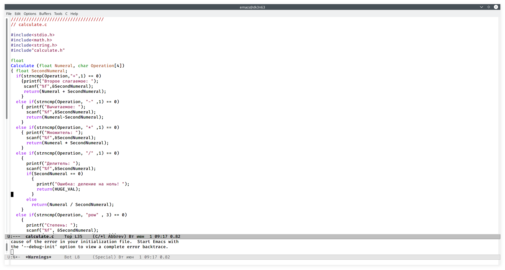
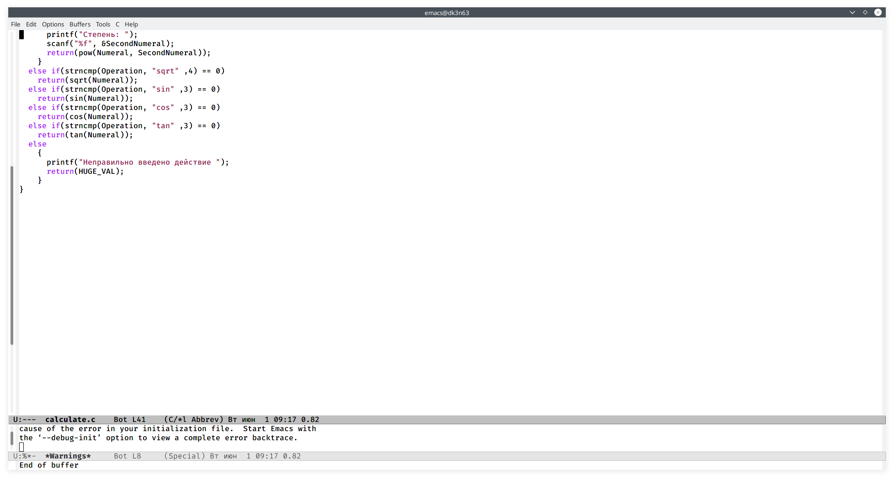
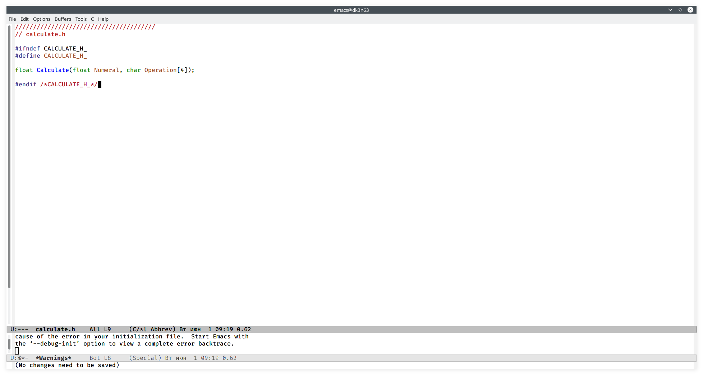
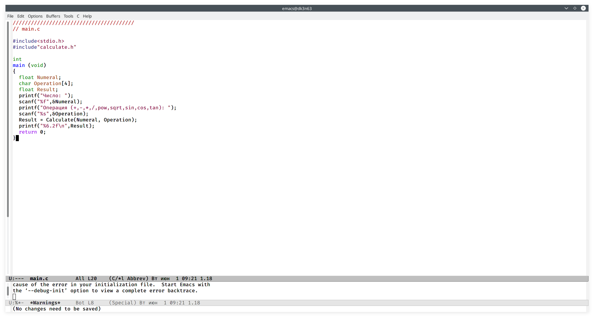
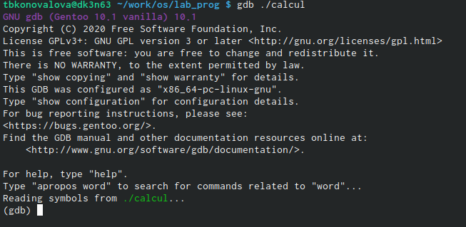

---
## Front matter
lang: ru-RU
title: Отчёт по лабораторной работе №14
author: Коновалова Татьяна Борисовна
institute: РУДН, Москва, Россия

date: 1 Июня 2021

## Formatting
toc: false
slide_level: 2
theme: metropolis
header-includes: 
 - \metroset{progressbar=frametitle,sectionpage=progressbar,numbering=fraction}
 - '\makeatletter'
 - '\beamer@ignorenonframefalse'
 - '\makeatother'
aspectratio: 43
section-titles: true
---

# Отчет по лабораторной работы №14

## Программа в calculate.c

Реализация функций калькулятора в файле calculate.с (Программа на рис. -@fig:003 ).

{ #fig:003 width=70% }

## Программа в calculate.c

Реализация функций калькулятора в файле calculate.с (Программа представлена на рис. -@fig:004 ).

{ #fig:004 width=70% }

## Программа в calculate.h

Интерфейсный файл calculate.h, описывающий формат вызова функции калькулятора (Скриншот -@fig:005 ).

{ #fig:005 width=70% }

## Программа в main.c

Основной файл main.c, реализующий интерфейс пользователя к калькулятору (Скриншот -@fig:006 ).

{ #fig:006 width=70% }

## Работа с gdb

Далее с помощью gdb выполнила отладку программы calcul (Рисунок -@fig:012 ).

{ #fig:012 width=70% }

## Выводы

В ходе выполнения данной лабораторной работы  я  приобрелапростейшие навыки разработки, анализа, тестирования и отладки приложений  в  ОС  типа UNIX/Linuxна примере создания на языке программирования С калькулятора с простейшими функциями.

## Библиография

1. Программное обеспечение GNU/Linux. Лекция 9. Хранилище и дистрибутив (Г. Курячий, МГУ)

2. Программное обеспечение GNU/Linux. Лекция 10. Минимальный набор знаний (Г. Курячий, МГУ)

3. Программное обеспечение GNU/Linux. Лекция 11. udev, DBus, PolicyKit (Г. Курячий, МГУ)

3. Электронный ресурс: https://vunivere.ru/work23597

4. Электронный ресурс: https://it.wikireading.ru/34160 

## {.standout}

Спасибо за внимание!
