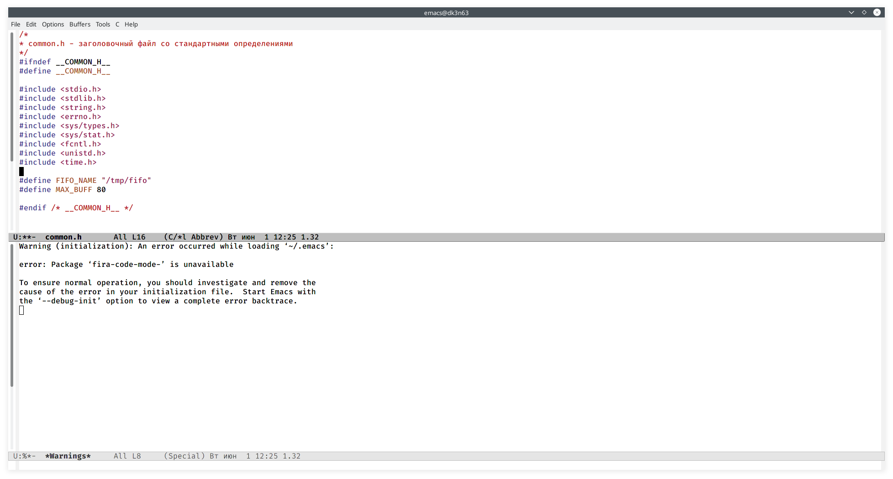
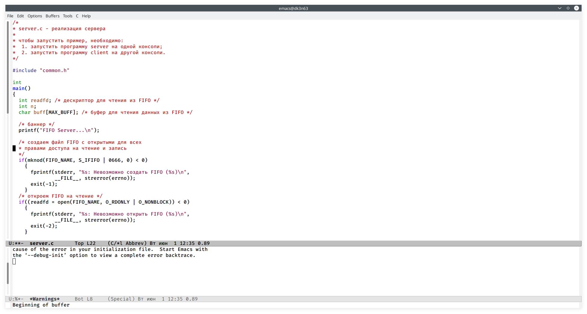
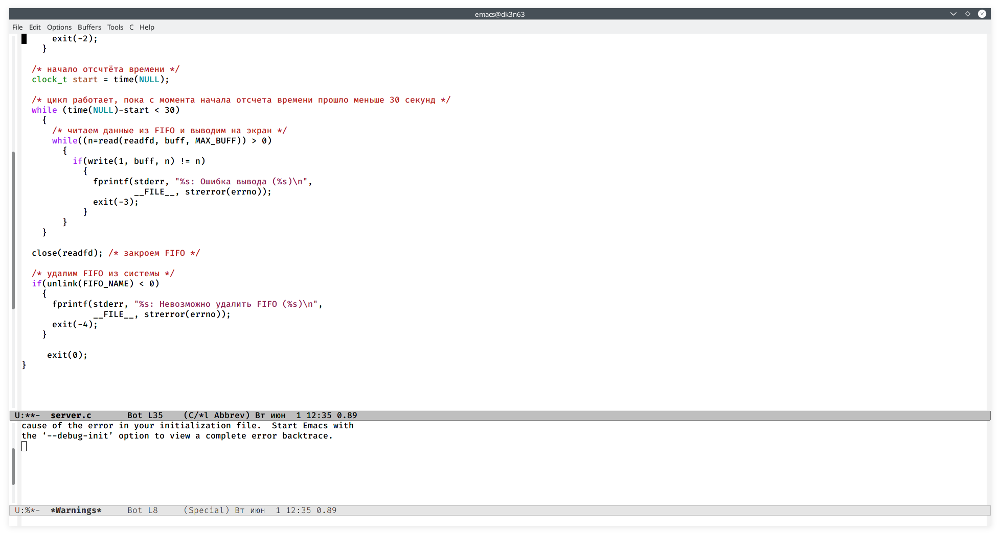
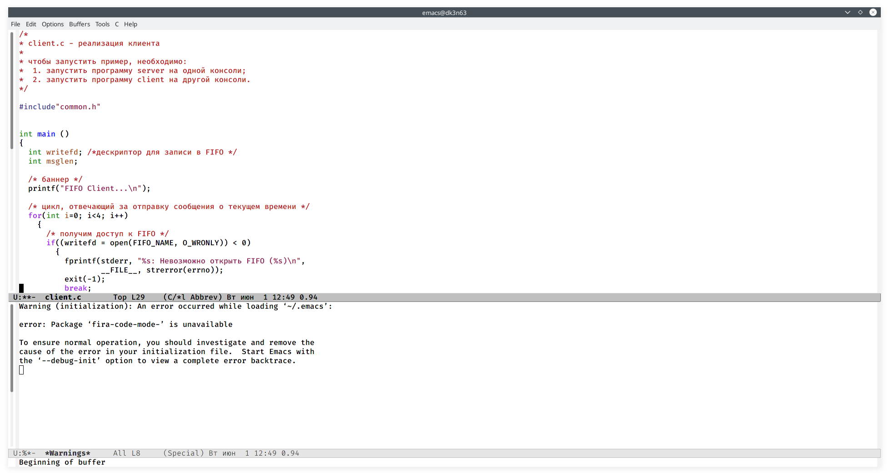
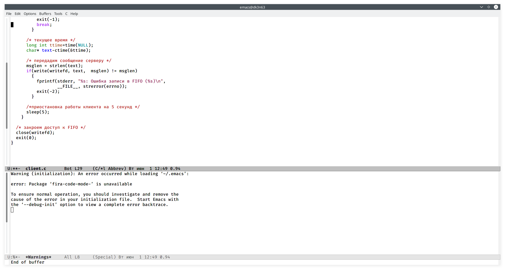
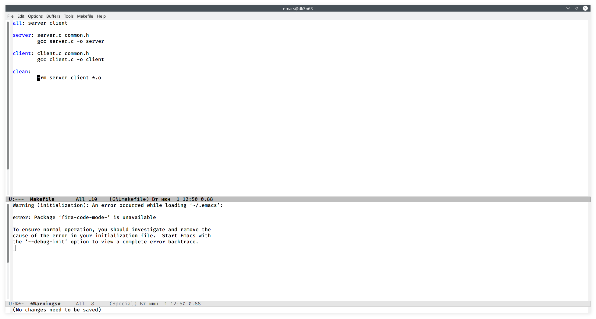

---
## Front matter
lang: ru-RU
title: Отчёт по лабораторной работе №15
author: Коновалова Татьяна Борисовна
institute: РУДН, Москва, Россия

date: 1 Июня 2021

## Formatting
toc: false
slide_level: 2
theme: metropolis
header-includes: 
 - \metroset{progressbar=frametitle,sectionpage=progressbar,numbering=fraction}
 - '\makeatletter'
 - '\beamer@ignorenonframefalse'
 - '\makeatother'
aspectratio: 43
section-titles: true
---

# Отчет по лабораторной работы №15

## Файл common.h

Common.h предназначен для заголовочных файлов, чтобы в остальных программах их не прописывать каждый раз (Программа рис. -@fig:002 ).

{ #fig:002 width=70% }

## Файл server.c

В файл server.c добавила цикл while для контроля за временем работы сервера (алгоритм действий представлен на рис. -@fig:003 ).

{ #fig:003 width=70% }

## Файл server.c

В файл server.c добавила цикл while для контроля за временем работы сервера (алгоритм действий представлен на рис. -@fig:003 ).

{ #fig:004 width=70% }

## Файл client.c

В файл client.c добавила цикл, который отвечает  за  количество сообщений о текущем времени (Скриншот -@fig:005 ).

{ #fig:005 width=70% }

## Файл client.c

В файл client.c добавила цикл, который отвечает  за  количество сообщений о текущем времени (Скриншот -@fig:005 ).

{ #fig:006 width=70% }

## Работа с Mikefile

Makefile (файл для сборки) не изменяла (Рисунок -@fig:007 ).

{ #fig:007 width=70% }

## Выводы

В ходе выполнения данной лабораторной работы я приобрела практические навыки работы с именованными каналами.

## Библиография

1. Программное обеспечение GNU/Linux. Лекция 10. Минимальный набор знаний (Г. Курячий, МГУ)

2. Программное обеспечение GNU/Linux. Лекция 12. Выбор дистрибутива (Г. Курячий, МГУ)

3. Электронный ресурс: https://habr.com/ru/post/122108/

4. Электронный ресурс: https://www.opennet.ru/docs/RUS/linux_parallel/node17.html

## {.standout}

Спасибо за внимание!
